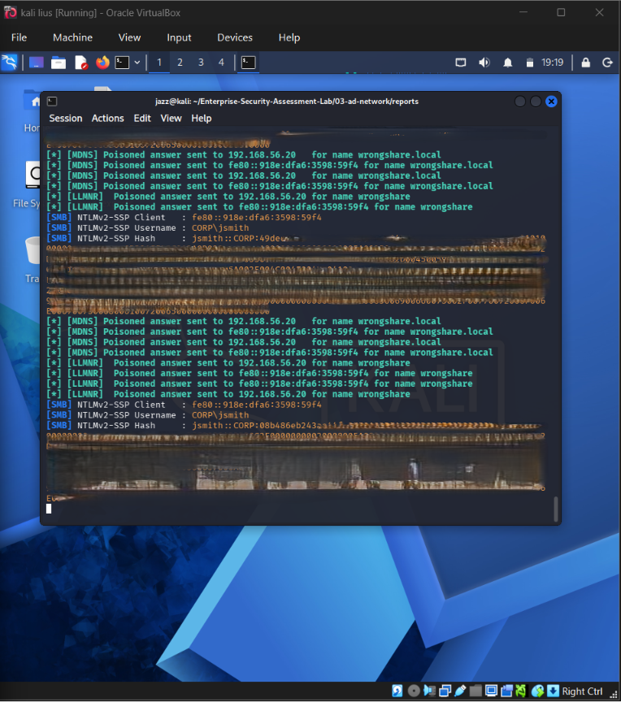
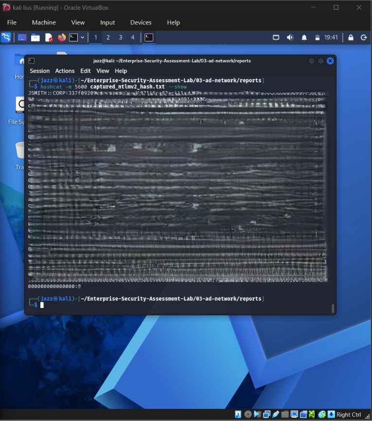
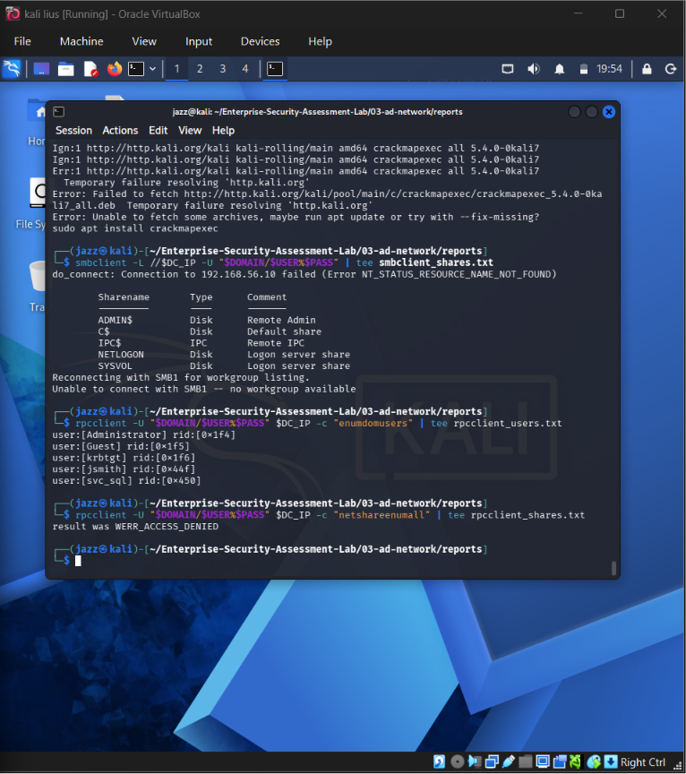
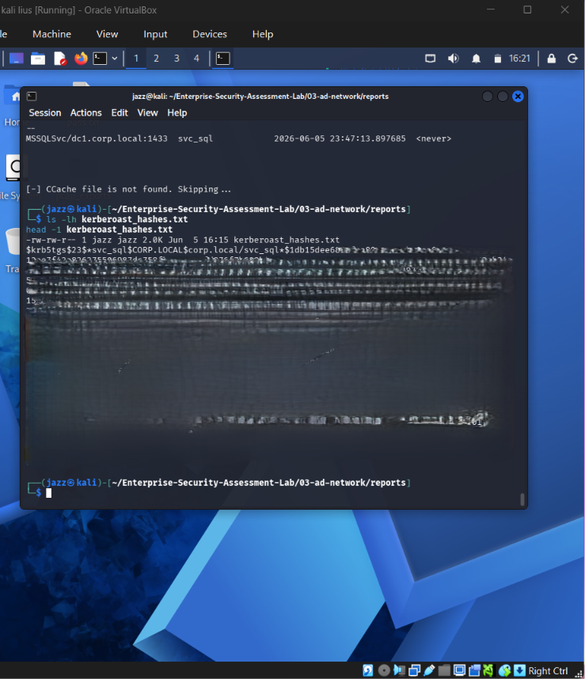
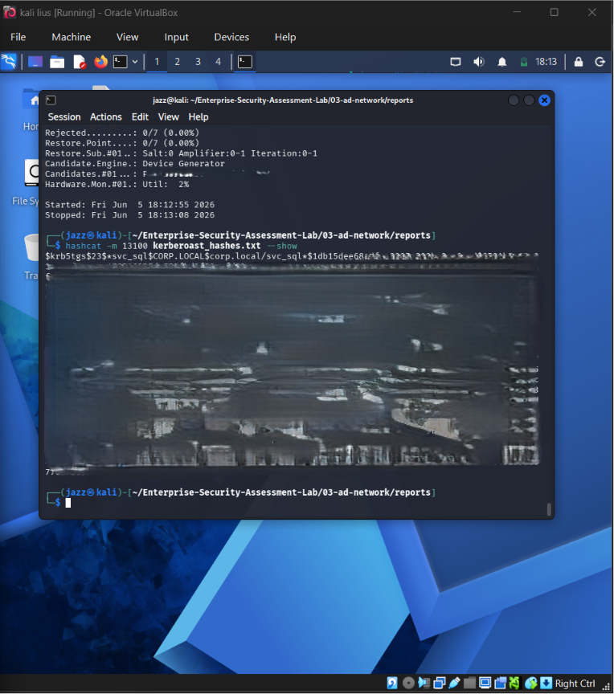
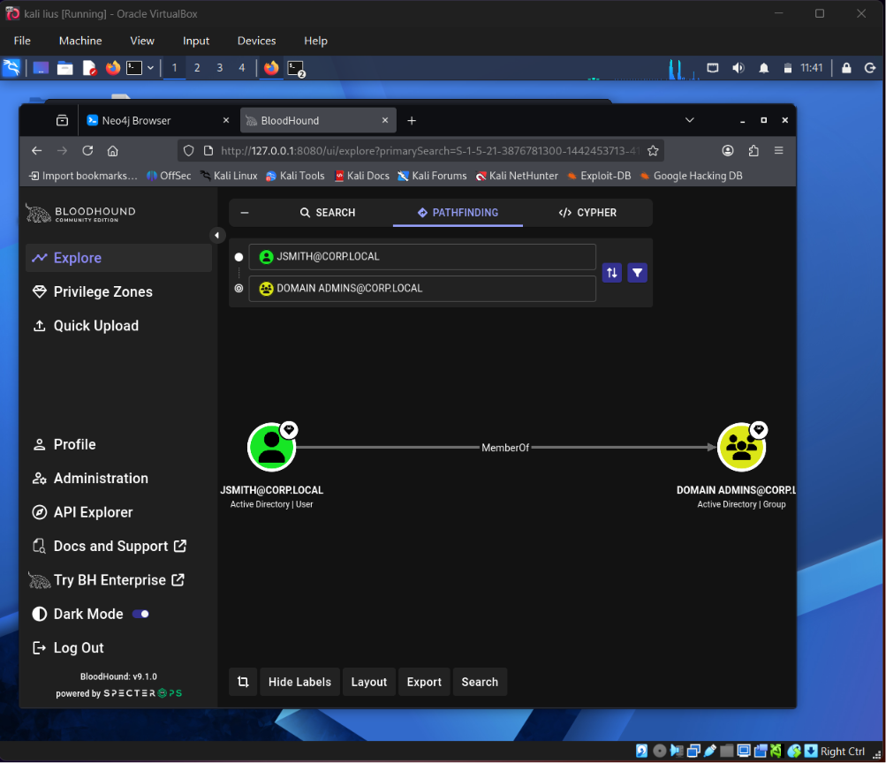
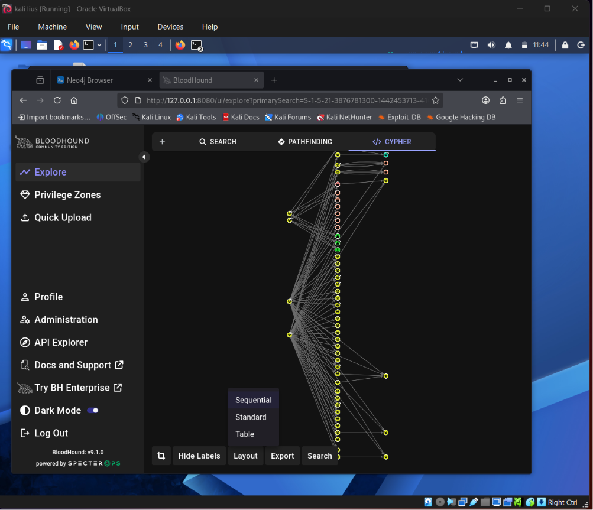
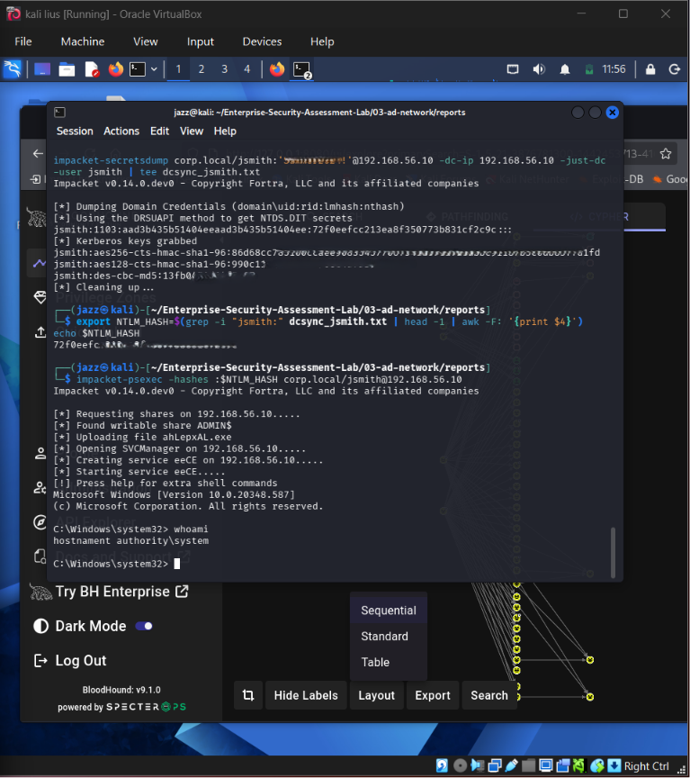
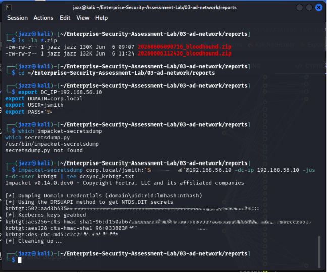

<div align="center">

# 🏢 Sub-Project 3 — Internal Network & Active Directory Pentest Lab


[](https://git.io/typing-svg)

<br/>

[](https://github.com/BloodHoundAD/BloodHound)
[](https://github.com/fortra/impacket)
[](https://attack.mitre.org/)
[](.)

<br/>


<br/>


<br/>

*Private Active Directory attack-path lab demonstrating internal enumeration, credential attack validation, Kerberoasting, BloodHound graph analysis, Pass-the-Hash, and DCSync testing with sensitive values redacted.*

[← API Security](../02-api-security/README.md) | [Back to Main Project](../README.md) | [Cloud Security →](../04-cloud-security/README.md)

</div>

---

## 📚 Table of Contents

* [📋 Engagement Summary](#-engagement-summary)
* [🎯 Assessment Scope](#-assessment-scope)
* [🏗️ Lab Environment](#️-lab-environment)
* [🧭 Active Directory Attack Path Overview](#-active-directory-attack-path-overview)
* [🧪 Evidence-Based Testing Summary](#-evidence-based-testing-summary)
* [⚔️ Methodology — Phase by Phase](#️-methodology--phase-by-phase)

  * [Phase 1 — Lab Connectivity and Domain Enumeration](#phase-1--lab-connectivity-and-domain-enumeration)
  * [Phase 2 — Responder NTLMv2 Hash Capture](#phase-2--responder-ntlmv2-hash-capture)
  * [Phase 3 — Offline Hash Cracking with Hashcat](#phase-3--offline-hash-cracking-with-hashcat)
  * [Phase 4 — SMB Credential Validation](#phase-4--smb-credential-validation)
  * [Phase 5 — Kerberoasting](#phase-5--kerberoasting)
  * [Phase 6 — Kerberoast Hash Cracking](#phase-6--kerberoast-hash-cracking)
  * [Phase 7 — BloodHound Attack Path Analysis](#phase-7--bloodhound-attack-path-analysis)
  * [Phase 8 — Pass-the-Hash Validation](#phase-8--pass-the-hash-validation)
  * [Phase 9 — DCSync Testing](#phase-9--dcsync-testing)
* [📊 MITRE ATT&CK Mapping](#-mitre-attck-mapping)
* [📸 Evidence Screenshots](#-evidence-screenshots)
* [🖼️ Screenshot Gallery](#️-screenshot-gallery)
* [📊 Confirmed Lab Findings Table](#-confirmed-lab-findings-table)
* [🧠 Key Security Lessons](#-key-security-lessons)
* [🔐 Redaction and Safety Notes](#-redaction-and-safety-notes)
* [✅ Completion Status](#-completion-status)

---

**AD Network Documentation**

[📄 AD Network Professional Assessment Report](./reports/AD-Network-Professional-Assessment-Report.pdf)


---


## 📋 Engagement Summary

| Field                       | Details                                                                                           |
| --------------------------- | ------------------------------------------------------------------------------------------------- |
| **Project Area**            | Internal Network and Active Directory Pentest                                                     |
| **Domain**                  | `corp.local`                                                                                      |
| **Environment Type**        | Private self-built Windows domain lab                                                             |
| **Domain Controller**       | Windows Server Domain Controller                                                                  |
| **Endpoint**                | Windows 10 domain-joined workstation                                                              |
| **Attack Machine**          | Kali Linux                                                                                        |
| **Network Type**            | Isolated private lab / host-only style environment                                                |
| **Testing Type**            | Authorized internal network assessment simulation                                                 |
| **Primary Focus**           | AD enumeration, credential attacks, Kerberoasting, BloodHound attack paths, Pass-the-Hash, DCSync |
| **Methodology Reference**   | Internal pentest methodology, MITRE ATT&CK, Active Directory attack-path analysis                 |
| **Assessment Status**       | Completed Practical Assessment                                                                    |
| **Evidence Style**          | Screenshot-based GitHub documentation                                                             |
| **Sensitive Data Handling** | Hashes, tickets, passwords, domain secrets, and DCSync output redacted before publication         |

> This Active Directory assessment was performed only inside a private lab environment. The goal was to understand internal attack paths, validate common enterprise weaknesses safely, and document the process professionally.

---

## 🎯 Assessment Scope

The Active Directory lab focused on the following areas:

```text
Private AD Lab Setup
→ Domain Connectivity
→ SMB and Domain Enumeration
→ NTLMv2 Hash Capture
→ Offline Hash Cracking
→ Credential Validation
→ Kerberoasting
→ Kerberoast Hash Cracking
→ BloodHound Collection and Graph Analysis
→ Attack Path to Domain Admin Review
→ Pass-the-Hash Validation
→ DCSync Testing
→ Redacted Evidence Documentation
```

### In Scope

| Area                              |      Status |
| --------------------------------- | ----------: |
| Windows Server Domain Controller  | ✅ Completed |
| Windows 10 domain-joined endpoint | ✅ Completed |
| Kali Linux attack machine         | ✅ Completed |
| SMB / domain enumeration          | ✅ Completed |
| Responder NTLMv2 hash capture     | ✅ Completed |
| Hashcat NTLMv2 cracking           | ✅ Completed |
| SMB credential validation         | ✅ Completed |
| Kerberoasting SPN ticket request  | ✅ Completed |
| Kerberoast hash cracking          | ✅ Completed |
| BloodHound attack path analysis   | ✅ Completed |
| BloodHound domain overview graph  | ✅ Completed |
| Pass-the-Hash validation          | ✅ Completed |
| DCSync domain hash dumping        | ✅ Completed |
| Full DCSync output redaction      | ✅ Completed |

### Out of Scope

| Area                        | Reason                                                    |
| --------------------------- | --------------------------------------------------------- |
| Real enterprise networks    | Not authorized                                            |
| Public IP targets           | Not part of the lab                                       |
| Malware deployment          | Not required for the assessment                           |
| Persistence or backdoors    | Excluded for safety and ethics                            |
| Golden Ticket execution     | Not performed; only DCSync/krbtgt exposure risk discussed |
| Unredacted hashes/passwords | Must not be published                                     |

---

## 🏗️ Lab Environment

```text
corp.local
│
├── Domain Controller
│   └── Windows Server
│       ├── Active Directory Domain Services
│       ├── DNS
│       ├── Kerberos
│       ├── LDAP
│       └── SMB
│
├── Domain-Joined Endpoint
│   └── Windows 10 Workstation
│       ├── Domain authentication
│       ├── SMB access
│       └── User activity simulation
│
└── Attack Platform
    └── Kali Linux
        ├── Responder
        ├── Hashcat
        ├── Impacket
        ├── NetExec / CrackMapExec
        ├── BloodHound
        └── Neo4j
```

### Lab Design Purpose

| Component                    | Purpose                                                              |
| ---------------------------- | -------------------------------------------------------------------- |
| Domain Controller            | Provides AD, Kerberos, LDAP, SMB, and domain authentication services |
| Windows Endpoint             | Simulates a domain-joined workstation                                |
| Kali Linux                   | Performs enumeration, credential testing, and attack path analysis   |
| BloodHound / Neo4j           | Maps and visualizes Active Directory relationships                   |
| Controlled Misconfigurations | Enables safe validation of common enterprise attack paths            |

---

## 🧭 Active Directory Attack Path Overview

```text
┌─────────────────────────────────────────────────────────────────────────────┐
│                  ACTIVE DIRECTORY ATTACK PATH — PRIVATE LAB                 │
├─────────────────────────────────────────────────────────────────────────────┤
│                                                                             │
│  1. Network / SMB Enumeration                                                │
│        ↓                                                                    │
│  2. Responder NTLMv2 Hash Capture                                            │
│        ↓                                                                    │
│  3. Offline Hash Cracking with Hashcat                                       │
│        ↓                                                                    │
│  4. Credential Validation Against SMB / Domain Services                      │
│        ↓                                                                    │
│  5. Kerberoasting SPN Ticket Request                                         │
│        ↓                                                                    │
│  6. Kerberoast Hash Cracking                                                 │
│        ↓                                                                    │
│  7. BloodHound Attack Path Analysis                                          │
│        ↓                                                                    │
│  8. Pass-the-Hash Validation                                                 │
│        ↓                                                                    │
│  9. DCSync Testing and Redacted Domain Hash Evidence                         │
│                                                                             │
└─────────────────────────────────────────────────────────────────────────────┘
```

---


## 🧪 Evidence-Based Testing Summary

| Test Area | Evidence File | Result Type |
|---|---|---|
| Responder NTLMv2 capture | [Open Report](./reports/evidence/01-responder-ntlmv2-capture-evidence-report.pdf) | Credential material captured in lab |
| Hashcat NTLMv2 cracking | [Open Report](./reports/evidence/02-hashcat-ntlmv2-cracking-evidence-report.pdf) | Captured hash cracked |
| SMB credential validation | [Open Report](./reports/evidence/03-smb-credential-validation-evidence-report.pdf) | Credentials validated |
| Kerberoasting SPN ticket request | [Open Report](./reports/evidence/04-kerberoasting-spn-ticket-request-evidence-report.pdf) | Kerberoastable ticket requested |
| Kerberoast hash cracking | [Open Report](./reports/evidence/05-kerberoast-hash-cracking-evidence-report.pdf) | Service account hash cracked |
| BloodHound attack path | [Open Report](./reports/evidence/06-bloodhound-attack-path-evidence-report.pdf) | Attack path visualized |
| BloodHound domain graph | [Open Report](./reports/evidence/07-bloodhound-domain-graph-evidence-report.pdf) | Domain relationships mapped |
| Pass-the-Hash validation | [Open Report](./reports/evidence/08-pass-the-hash-validation-evidence-report.pdf) | PTH access validated |
| DCSync limited output | [Open Report](./reports/evidence/09-dcsync-limited-output-evidence-report.pdf) | Domain hash dump evidence |
| DCSync full output | [Open Report](./reports/evidence/10-dcsync-full-output-evidence-report.pdf) | Full lab DCSync output with sensitive values redacted |


---

# ⚔️ Methodology — Phase by Phase

---

## Phase 1 — Lab Connectivity and Domain Enumeration

**Objective:** Confirm domain connectivity and identify domain services before credential-based testing.

```bash
# Identify local network interfaces
ip -br a

# Discover hosts in the private lab network
nmap -sn <LAB_SUBNET>

# Scan common Domain Controller services
nmap -sV -sC -p 53,88,135,139,389,445,464,636,3268,3389 <DC_IP>
```

Key services expected on a Domain Controller:

```text
53    DNS
88    Kerberos
135   MSRPC
139   NetBIOS
389   LDAP
445   SMB
464   Kerberos password change
636   LDAPS
3268  Global Catalog
3389  RDP
```

**Result:**

```text
Domain services were identified and the internal lab environment was ready for Active Directory testing.
```

**Lab Connectivity and Domain Enumeration** 

[Open Report](./reports/methodology/01-ad-lab-connectivity-and-domain-enumeration-methodology-report.pdf)

---

## Phase 2 — Responder NTLMv2 Hash Capture

**MITRE ATT&CK:** `T1557.001 — LLMNR/NBT-NS Poisoning and SMB Relay`

**Objective:** Capture NTLMv2 authentication material from a domain-joined Windows endpoint in a controlled lab environment.

```bash
# Start Responder on the lab-facing interface
sudo responder -I <LAB_INTERFACE> -v
```

A Windows endpoint was used to trigger authentication to a non-existing network resource, causing name resolution traffic and NTLMv2 authentication material to be captured by Responder.

```text
\\nonexistent-lab-share\test
```

**Evidence captured:**

```text
10-responder-ntlmv2-hash-captured.png
```

**Observed behaviour:**

```text
Responder captured a NetNTLMv2 hash from the lab environment.
```

**Risk:**

```text
In real environments, LLMNR/NBT-NS poisoning can allow attackers on the internal network to capture credential material from domain users.
```

**Recommended remediation:**

```text
Disable LLMNR and NBT-NS where possible.
Enforce SMB signing.
Use strong passwords.
Monitor for rogue name resolution responses.
Restrict unnecessary broadcast name resolution.
```

**Responder NTLMv2 Hash Capture** 

[Open Report](./reports/methodology/02-responder-ntlmv2-hash-capture-methodology-report.pdf)

---

## Phase 3 — Offline Hash Cracking with Hashcat

**MITRE ATT&CK:** `T1110.002 — Password Cracking`

**Objective:** Demonstrate the risk of weak passwords by cracking a captured NetNTLMv2 hash offline.

```bash
# Example Hashcat mode for NetNTLMv2
hashcat -m 5600 captured_ntlmv2_hashes.txt /usr/share/wordlists/rockyou.txt
```

**Evidence captured:**

```text
11-hashcat-ntlmv2-cracked.png
```

**Observed behaviour:**

```text
The captured NTLMv2 hash was cracked in the lab environment.
```

**Risk:**

```text
Weak passwords can turn captured hashes into valid domain credentials.
```

**Recommended remediation:**

```text
Use strong password policies.
Block common passwords.
Deploy MFA where possible.
Monitor for abnormal authentication attempts.
Disable LLMNR/NBT-NS.
```

**Offline Hash Cracking with Hashcat** 

[Open Report](./reports/methodology/03-offline-hash-cracking-with-hashcat-methodology-report.pdf)

---

## Phase 4 — SMB Credential Validation

**Objective:** Validate whether cracked credentials were valid against domain SMB services.

```bash
# Example credential validation workflow
netexec smb <DC_IP> -u <REDACTED_USER> -p '<REDACTED_PASSWORD>'

# Alternative tool
crackmapexec smb <DC_IP> -u <REDACTED_USER> -p '<REDACTED_PASSWORD>'
```

**Evidence captured:**

```text
12-smb-enumeration-credential-validation.png
```

**Observed behaviour:**

```text
Credentials were validated against SMB/domain services in the lab.
```

**Risk:**

```text
Once credentials are validated, an attacker can enumerate shares, users, groups, and possible privilege paths.
```

**Recommended remediation:**

```text
Enforce strong passwords.
Monitor SMB authentication attempts.
Limit lateral movement opportunities.
Restrict share permissions.
Use least privilege for domain users.
```

**SMB Credential Validation and Enumeration** 

[Open Report](./reports/methodology/04-smb-credential-validation-and-enumeration-methodology-report.pdf)

---

## Phase 5 — Kerberoasting

**MITRE ATT&CK:** `T1558.003 — Kerberoasting`

**Objective:** Request Kerberos service tickets for SPN-enabled accounts and test whether service account passwords could be cracked offline.

```bash
# Identify and request Kerberoastable tickets using Impacket
GetUserSPNs.py <DOMAIN>/<USER>:<PASSWORD> -dc-ip <DC_IP> -request -outputfile kerberoast_hashes.txt
```

**Evidence captured:**

```text
13-kerberoasting-spn-ticket-requested.png
```

**Observed behaviour:**

```text
Kerberoastable service ticket material was requested in the lab environment.
```

**Risk:**

```text
If service account passwords are weak, attackers can crack Kerberos service tickets offline without triggering normal login lockouts.
```

**Recommended remediation:**

```text
Use long, complex, randomly generated service account passwords.
Use Group Managed Service Accounts where possible.
Monitor abnormal TGS requests.
Reduce SPN exposure.
Avoid assigning privileged rights to service accounts.
```

**Kerberoasting SPN Ticket Request** 

[Open Report](./reports/methodology/05-kerberoasting-spn-ticket-request-methodology-report.pdf)

---

## Phase 6 — Kerberoast Hash Cracking

**Objective:** Crack the requested Kerberoast hash offline to validate service account password weakness.

```bash
# Common Hashcat mode for Kerberos 5 TGS-REP etype 23
hashcat -m 13100 kerberoast_hashes.txt /usr/share/wordlists/rockyou.txt
```

**Evidence captured:**

```text
14-kerberoast-hash-cracked.png
```

**Observed behaviour:**

```text
Kerberoast hash cracking was demonstrated in the private lab.
```

**Risk:**

```text
A cracked service account password can provide access to additional services, shares, or privilege paths.
```

**Recommended remediation:**

```text
Use strong service account passwords.
Rotate service account credentials.
Monitor Kerberos ticket request patterns.
Minimize service account privileges.
```

**Kerberoast Hash Cracking** 

[Open Report](./reports/methodology/06-kerberoast-hash-cracking-methodology-report.pdf)

---

## Phase 7 — BloodHound Attack Path Analysis

**MITRE ATT&CK:** `T1069.002 — Domain Groups` and `T1482 — Domain Trust Discovery`

**Objective:** Collect and visualize Active Directory relationships to identify privilege paths.

```bash
# Start Neo4j
sudo neo4j start

# Start BloodHound GUI
bloodhound

# Collect data using BloodHound Python collector
bloodhound-python \
  -d corp.local \
  -u <REDACTED_USER> \
  -p '<REDACTED_PASSWORD>' \
  -dc <DC_HOSTNAME_OR_IP> \
  -c all \
  --zip
```

BloodHound was used to review:

```text
Shortest paths to Domain Admins
Domain overview graph
Group memberships
Privilege relationships
Potential escalation paths
```

**Evidence captured:**

```text
15-bloodhound-attack-path-domain-admin.png
16-bloodhound-domain-overview-graph.png
```

**Observed behaviour:**

```text
BloodHound visualized domain relationships and a path to high privilege in the lab.
```

**Risk:**

```text
Misconfigured group memberships and excessive privileges can create unintended paths to domain compromise.
```

**Recommended remediation:**

```text
Review privileged group membership regularly.
Remove unnecessary local admin rights.
Apply least privilege.
Audit BloodHound-style attack paths defensively.
Monitor changes to privileged groups.
```

**BloodHound Attack Path Analysis** 

[Open Report](./reports/methodology/07-bloodhound-attack-path-analysis-methodology-report.pdf)

---

## Phase 8 — Pass-the-Hash Validation

**MITRE ATT&CK:** `T1550.002 — Pass the Hash`

**Objective:** Validate whether NTLM hash material could be used for authentication without knowing the plaintext password.

```bash
# Example Impacket-style Pass-the-Hash workflow
psexec.py <DOMAIN>/<USER>@<TARGET_IP> -hashes :<REDACTED_NTLM_HASH>
```

**Evidence captured:**

```text
17-pass-the-hash-system-shell-obtained.png
```

**Observed behaviour:**

```text
Pass-the-Hash validation resulted in privileged shell access in the private lab.
```

**Risk:**

```text
NTLM hashes can sometimes be used like passwords. If hashes are exposed, attackers may move laterally or gain privileged access.
```

**Recommended remediation:**

```text
Reduce local administrator reuse.
Use Credential Guard where possible.
Restrict NTLM authentication.
Monitor privileged logons.
Rotate compromised credentials.
Apply tiered administration.
```

**Pass-the-Hash Validation** 

[Open Report](./reports/methodology/08-pass-the-hash-validation-methodology-report.pdf)

---

## Phase 9 — DCSync Testing

**MITRE ATT&CK:** `T1003.006 — DCSync`

**Objective:** Validate whether high-privilege or replication-level access could request domain credential material.

```bash
# Example DCSync-style workflow using Impacket secretsdump
secretsdump.py <DOMAIN>/<USER>@<DC_IP> -just-dc
```

**Evidence captured:**

```text
18-dcsync-domain-hashes-dumped.png
18b-dcsync-all-domain-hashes-dumped.png
```

**Observed behaviour:**

```text
DCSync testing produced domain hash evidence in the controlled lab environment.
```

**Important note:**

```text
DCSync output can include krbtgt material. This could enable Golden Ticket-style attacks in a real compromise scenario, but Golden Ticket execution is not claimed in this project.
```

**Risk:**

```text
DCSync access can expose password hashes for domain accounts, including high-value accounts.
```

**Recommended remediation:**

```text
Restrict replication privileges.
Audit accounts with Replicating Directory Changes permissions.
Monitor DCSync-like behaviour.
Protect Domain Admin and replication-capable accounts.
Rotate krbtgt if domain compromise is suspected.
```

**DCSync Replication Abuse Testing** 

[Open Report](./reports/methodology/09-dcsync-replication-abuse-testing-methodology-report.pdf)

---

## 📊 MITRE ATT&CK Mapping

| Attack / Activity                    | Technique                                                     | MITRE ID          |
| ------------------------------------ | ------------------------------------------------------------- | ----------------- |
| LLMNR/NBT-NS poisoning               | Adversary-in-the-Middle: LLMNR/NBT-NS Poisoning and SMB Relay | T1557.001         |
| Password cracking                    | Brute Force: Password Cracking                                | T1110.002         |
| SMB/domain enumeration               | Account Discovery / Remote System Discovery                   | T1087 / T1018     |
| Kerberoasting                        | Steal or Forge Kerberos Tickets: Kerberoasting                | T1558.003         |
| BloodHound-style group/path analysis | Domain Groups / Domain Trust Discovery                        | T1069.002 / T1482 |
| Pass-the-Hash                        | Use Alternate Authentication Material: Pass the Hash          | T1550.002         |
| DCSync                               | OS Credential Dumping: DCSync                                 | T1003.006         |

---

## 📸 Evidence Screenshots

| #   | Screenshot Name                                | Description                                       |
| --- | ---------------------------------------------- | ------------------------------------------------- |
| 10  | `10-responder-ntlmv2-hash-captured.png`        | Responder captured NTLMv2 hash                    |
| 11  | `11-hashcat-ntlmv2-cracked.png`                | Captured NTLMv2 hash cracked with Hashcat         |
| 12  | `12-smb-enumeration-credential-validation.png` | SMB/domain credential validation                  |
| 13  | `13-kerberoasting-spn-ticket-requested.png`    | Kerberoasting SPN ticket requested                |
| 14  | `14-kerberoast-hash-cracked.png`               | Kerberoast hash cracked                           |
| 15  | `15-bloodhound-attack-path-domain-admin.png`   | BloodHound attack path to Domain Admin            |
| 16  | `16-bloodhound-domain-overview-graph.png`      | BloodHound domain overview graph                  |
| 17  | `17-pass-the-hash-system-shell-obtained.png`   | Pass-the-Hash validation and SYSTEM shell         |
| 18  | `18-dcsync-domain-hashes-dumped.png`           | DCSync domain hash evidence                       |
| 18b | `18b-dcsync-all-domain-hashes-dumped.png`      | Full DCSync output with sensitive values redacted |

---

## 🖼️ Screenshot Gallery

> Full hashes, cracked passwords, Kerberos tickets, NTLM hashes, DCSync output, and domain secrets must be redacted before public upload.

Responder NTLMv2 Hash Captured
---

---

Hashcat NTLMv2 Cracked
---

---

SMB Enumeration Credential Validation
---

---

Kerberoasting SPN Ticket Requested
---

---

Kerberoast Hash Cracked
---

---

BloodHound Attack Path Domain Admin
---

---

BloodHound Domain Overview Graph
---

---

Pass-the-Hash SYSTEM Shell Obtained
---

---

DCSync Domain Hashes Dumped
---

---

DCSync All Domain Hashes Dumped
---

---

---

## 📊 Confirmed Lab Findings Table

This table is based only on the evidence currently available in this folder.

| #  | Finding / Test Case                                | Severity Style                       | Evidence                                       | Status             |
| -- | -------------------------------------------------- | ------------------------------------ | ---------------------------------------------- | ------------------ |
| 1  | NTLMv2 Hash Capture via Responder                  | 🟠 High in real-world context        | `10-responder-ntlmv2-hash-captured.png`        | ✅ Validated in lab |
| 2  | Weak Password Cracked Offline                      | 🔴 Critical if privileged account    | `11-hashcat-ntlmv2-cracked.png`                | ✅ Validated in lab |
| 3  | SMB Credential Validation                          | 🟠 High in real-world context        | `12-smb-enumeration-credential-validation.png` | ✅ Validated in lab |
| 4  | Kerberoastable Service Account Ticket Requested    | 🟠 High in real-world context        | `13-kerberoasting-spn-ticket-requested.png`    | ✅ Validated in lab |
| 5  | Kerberoast Hash Cracked                            | 🔴 Critical if account is privileged | `14-kerberoast-hash-cracked.png`               | ✅ Validated in lab |
| 6  | BloodHound Path to Domain Admin                    | 🔴 Critical in real-world context    | `15-bloodhound-attack-path-domain-admin.png`   | ✅ Validated in lab |
| 7  | Domain Relationship Exposure / Attack Path Mapping | 🟡 Medium to High                    | `16-bloodhound-domain-overview-graph.png`      | ✅ Completed        |
| 8  | Pass-the-Hash Privileged Access                    | 🔴 Critical in real-world context    | `17-pass-the-hash-system-shell-obtained.png`   | ✅ Validated in lab |
| 9  | DCSync Domain Hash Dump                            | 🔴 Critical in real-world context    | `18-dcsync-domain-hashes-dumped.png`           | ✅ Validated in lab |
| 10 | Full Domain Hash Exposure in Lab                   | 🔴 Critical in real-world context    | `18b-dcsync-all-domain-hashes-dumped.png`      | ✅ Validated in lab |

> Severity is expressed as “real-world context” because the environment is an intentionally configured private lab. Final CVSS scoring should only be added if each finding is formally scored in a dedicated report.

---

## 🧠 Key Security Lessons

| Area                  | Lesson                                                                             |
| --------------------- | ---------------------------------------------------------------------------------- |
| Name Resolution       | LLMNR/NBT-NS can expose credential material on internal networks                   |
| Password Security     | Weak passwords make captured hashes much more dangerous                            |
| Credential Validation | Cracked credentials can unlock domain enumeration and lateral movement             |
| Kerberoasting         | Service accounts with weak passwords are high-risk                                 |
| BloodHound            | Graph analysis reveals privilege paths that may not be obvious manually            |
| Pass-the-Hash         | NTLM hashes should be protected like plaintext passwords                           |
| DCSync                | Replication privileges can expose domain-wide credential material                  |
| krbtgt Exposure       | DCSync can expose krbtgt material, which could enable Golden Ticket-style abuse    |
| Least Privilege       | Excessive privileges create avoidable attack paths                                 |
| Reporting             | Hashes, tickets, passwords, and domain secrets must be redacted before publication |

---

## 🔐 Redaction and Safety Notes

Before publishing this folder publicly, redact:

```text
NTLM hashes
NetNTLMv2 hashes
Kerberos tickets
Kerberoast hashes
Cracked passwords
Domain usernames if private
Machine names if private
DCSync hash output
krbtgt hash material
Administrator hashes
Session values
Internal IPs if privacy is required
```

Do not commit:

```text
raw DCSync dumps
unredacted NTLM hashes
unredacted Kerberos hashes
cracked passwords
password lists with real credentials
BloodHound zip files containing sensitive domain data
Neo4j database exports
secretsdump raw output
ticket files
.ccache files
.kirbi files
```

If any output is uploaded, replace sensitive values with placeholders:

```text
<REDACTED_HASH>
<REDACTED_PASSWORD>
<REDACTED_USER>
<REDACTED_DOMAIN>
<REDACTED_TICKET>
<REDACTED_DCSYNC_OUTPUT>
```

---

## ✅ Completion Status

| Section                             |      Status |
| ----------------------------------- | ----------: |
| Private AD lab environment          | ✅ Completed |
| Domain connectivity and enumeration | ✅ Completed |
| Responder NTLMv2 capture            | ✅ Completed |
| Hashcat cracking                    | ✅ Completed |
| SMB credential validation           | ✅ Completed |
| Kerberoasting ticket request        | ✅ Completed |
| Kerberoast hash cracking            | ✅ Completed |
| BloodHound attack path analysis     | ✅ Completed |
| BloodHound domain graph review      | ✅ Completed |
| Pass-the-Hash validation            | ✅ Completed |
| DCSync testing                      | ✅ Completed |
| Sensitive data redaction reminders  |  ✅ Included |
| GitHub documentation                | ✅ Completed |

---

<div align="center">


### Active Directory security is about understanding relationships, privileges, and how one weak link can become a full attack path.

[← API Security](../02-api-security/README.md) | [Back to Main](../README.md) | [Cloud Security →](../04-cloud-security/README.md)

</div>
