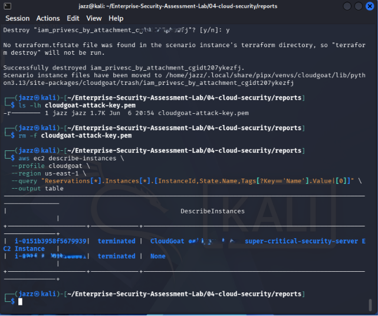
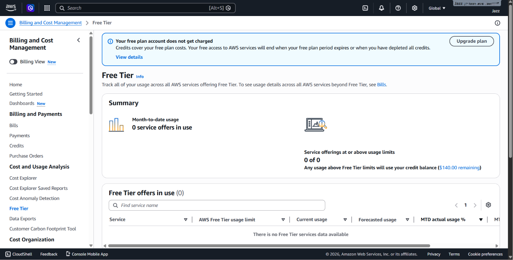

<div align="center">

# ☁️ Sub-Project 4 — AWS Cloud Security Assessment Lab


[](https://git.io/typing-svg)

<br/>

[](https://aws.amazon.com/)
[](https://github.com/RhinoSecurityLabs/cloudgoat)
[](https://github.com/RhinoSecurityLabs/pacu)
[](https://github.com/nccgroup/ScoutSuite)
[](.)

<br/>


<br/>

*Authorized AWS cloud security lab using CloudGoat, AWS CLI, Pacu, ScoutSuite, S3 unauthenticated access testing, IMDS credential exposure validation, and cleanup/billing verification.*

[← AD & Network](../03-ad-network/README.md) | [Back to Main Project](../README.md) | [Azure Security →](../05-azure-security/README.md)

</div>

---

## 📚 Table of Contents

* [📋 Engagement Summary](#-engagement-summary)
* [🎯 Assessment Scope](#-assessment-scope)
* [✅ AWS Safety Controls](#-aws-safety-controls)
* [☁️ AWS Attack Surface Reviewed](#️-aws-attack-surface-reviewed)
* [🧭 Cloud Attack Path Overview](#-cloud-attack-path-overview)
* [🧪 Evidence-Based Testing Summary](#-evidence-based-testing-summary)
* [🔬 Methodology — Phase by Phase](#-methodology--phase-by-phase)

  * [Phase 1 — AWS CLI Authentication and Identity Verification](#phase-1--aws-cli-authentication-and-identity-verification)
  * [Phase 2 — IAM Permissions Enumeration](#phase-2--iam-permissions-enumeration)
  * [Phase 3 — Pacu Privilege Escalation Scan](#phase-3--pacu-privilege-escalation-scan)
  * [Phase 4 — S3 Public / Unauthenticated Access Testing](#phase-4--s3-public--unauthenticated-access-testing)
  * [Phase 5 — ScoutSuite AWS Security Audit](#phase-5--scoutsuite-aws-security-audit)
  * [Phase 6 — EC2 IMDS Credential Exposure Testing](#phase-6--ec2-imds-credential-exposure-testing)
  * [Phase 7 — CloudGoat Objective and EC2 Cleanup Verification](#phase-7--cloudgoat-objective-and-ec2-cleanup-verification)
  * [Phase 8 — Free Tier / Billing Verification](#phase-8--free-tier--billing-verification)
* [📊 MITRE ATT&CK Mapping](#-mitre-attck-mapping)
* [📸 Evidence Screenshots](#-evidence-screenshots)
* [🖼️ Screenshot Gallery](#️-screenshot-gallery)
* [📊 Confirmed Lab Findings / Validated Tests](#-confirmed-lab-findings--validated-tests)
* [🧠 Key Cloud Security Lessons](#-key-cloud-security-lessons)
* [🔐 Redaction and Safety Notes](#-redaction-and-safety-notes)
* [📂 Files in This Folder](#-files-in-this-folder)
* [✅ Completion Status](#-completion-status)

---

## 📋 Engagement Summary

| Field                        | Details                                                                                                                        |
| ---------------------------- | ------------------------------------------------------------------------------------------------------------------------------ |
| **Project Area**             | AWS Cloud Security Assessment                                                                                                  |
| **Primary Cloud Provider**   | Amazon Web Services                                                                                                            |
| **Lab Environment**          | CloudGoat in personal AWS lab account                                                                                          |
| **Testing Type**             | Authorized vulnerable cloud lab assessment                                                                                     |
| **Region Used**              | `us-east-1`                                                                                                                    |
| **Main AWS Services Tested** | IAM, S3, EC2, IMDS, ScoutSuite-audited AWS services                                                                            |
| **Tools Used**               | AWS CLI, CloudGoat, Pacu, ScoutSuite, Terraform, curl, jq, AWS Console                                                         |
| **Primary Focus**            | IAM permissions, privilege escalation paths, S3 exposure, IMDS credential exposure, cloud audit evidence, cleanup verification |
| **Assessment Status**        | Completed Practical Assessment                                                                                                 |
| **Evidence Style**           | Screenshot-based GitHub documentation                                                                                          |
| **Sensitive Data Handling**  | Account IDs, ARNs, access keys, secret keys, session tokens, public IPs, and resource IDs redacted where needed                |

> This cloud assessment was performed only in a personal AWS training environment using intentionally vulnerable infrastructure. The goal was to understand cloud misconfigurations, privilege escalation paths, metadata credential exposure, and responsible cleanup.

---

## 🎯 Assessment Scope

The AWS cloud lab focused on the following areas:

```text
AWS Account Safety Setup
→ AWS CLI Authentication
→ IAM Identity Verification
→ IAM Permissions Enumeration
→ Pacu Privilege Escalation Scan
→ S3 Public / Unauthenticated Access Testing
→ ScoutSuite AWS Audit
→ ScoutSuite Finding Review
→ EC2 Metadata / IMDS Credential Exposure
→ IAM Instance Profile Privilege Escalation
→ CloudGoat Objective Completion
→ CloudGoat Resource Cleanup
→ Free Tier / Billing Verification
```

### In Scope

| Area                                                              |      Status |
| ----------------------------------------------------------------- | ----------: |
| AWS CLI authentication                                            | ✅ Completed |
| IAM identity verification                                         | ✅ Completed |
| IAM permissions enumeration                                       | ✅ Completed |
| Pacu privilege escalation scan                                    | ✅ Completed |
| S3 unauthenticated access test                                    | ✅ Completed |
| ScoutSuite HTML report overview                                   | ✅ Completed |
| ScoutSuite detailed finding review                                | ✅ Completed |
| IMDS credential exposure testing                                  | ✅ Completed |
| IAM instance profile / role-based privilege escalation validation | ✅ Completed |
| CloudGoat EC2 cleanup verification                                | ✅ Completed |
| Free Tier / billing verification                                  | ✅ Completed |

### Out of Scope / Not Claimed

| Area                          | Reason                                            |
| ----------------------------- | ------------------------------------------------- |
| Root account without MFA      | Not claimed — MFA was enabled as a safety control |
| Prowler assessment            | Not claimed in current evidence                   |
| Boto3 automation script       | Not claimed in current evidence                   |
| RDS public exposure           | Not claimed unless separate evidence exists       |
| Lambda secret exposure        | Not claimed unless separate evidence exists       |
| CloudTrail disabled finding   | Not claimed unless separate evidence exists       |
| Real production cloud testing | Not authorized                                    |
| Unredacted credentials/tokens | Never published                                   |

---

## ✅ AWS Safety Controls

Before and after running the AWS cloud lab, safety controls were used to reduce risk and cost exposure.

| Safety Control                             |      Status |
| ------------------------------------------ | ----------: |
| Root account MFA enabled                   | ✅ Completed |
| Budget / Free Tier monitoring checked      | ✅ Completed |
| Dedicated AWS lab user/profile used        | ✅ Completed |
| CloudGoat deployed only temporarily        | ✅ Completed |
| Access keys and tokens redacted            | ✅ Completed |
| CloudGoat scenario destroyed after testing | ✅ Completed |
| EC2 cleanup verified                       | ✅ Completed |
| Billing / Free Tier usage checked          | ✅ Completed |

---

## ☁️ AWS Attack Surface Reviewed

```text
┌──────────────────────────────────────────────────────────────────────────────┐
│                         AWS CLOUD ATTACK SURFACE REVIEW                      │
├───────────────────┬──────────────────────────────────────────────────────────┤
│ IAM               │ Users, roles, policies, attached/inline permissions       │
│                   │ → Permission enumeration and privilege escalation review   │
├───────────────────┼──────────────────────────────────────────────────────────┤
│ S3                │ Buckets, objects, public/anonymous access behaviour        │
│                   │ → Unauthenticated access testing with --no-sign-request    │
├───────────────────┼──────────────────────────────────────────────────────────┤
│ EC2               │ Instances, instance profiles, metadata service, IMDS       │
│                   │ → Temporary credential exposure and role-based access      │
├───────────────────┼──────────────────────────────────────────────────────────┤
│ ScoutSuite Audit  │ Multi-service AWS configuration review                     │
│                   │ → Dashboard overview and specific finding validation       │
├───────────────────┼──────────────────────────────────────────────────────────┤
│ Cleanup / Billing │ EC2 cleanup, CloudGoat destruction, Free Tier check        │
│                   │ → Responsible cloud lab hygiene                            │
└───────────────────┴──────────────────────────────────────────────────────────┘
```

---

## 🧭 Cloud Attack Path Overview

```text
┌─────────────────────────────────────────────────────────────────────────────┐
│                     CLOUDGOAT AWS ATTACK PATH — PRIVATE LAB                 │
├─────────────────────────────────────────────────────────────────────────────┤
│                                                                             │
│  1. AWS CLI authentication with lab credentials                              │
│        ↓                                                                    │
│  2. IAM identity and permission enumeration                                  │
│        ↓                                                                    │
│  3. Pacu privilege escalation scan                                           │
│        ↓                                                                    │
│  4. S3 unauthenticated access testing                                        │
│        ↓                                                                    │
│  5. ScoutSuite AWS security audit                                            │
│        ↓                                                                    │
│  6. EC2 IMDS credential exposure validation                                  │
│        ↓                                                                    │
│  7. IAM role / instance profile privilege path validation                    │
│        ↓                                                                    │
│  8. CloudGoat objective completion and cleanup verification                  │
│        ↓                                                                    │
│  9. Free Tier / billing review                                               │
│                                                                             │
└─────────────────────────────────────────────────────────────────────────────┘
```

---

## 🧪 Evidence-Based Testing Summary

| Test Area | Evidence File | Result Type |
|---|---|---|
| IAM permissions enumeration | [Open Report](./reports/evidence/01-iam-permissions-enumeration-evidence-report.pdf) | IAM identity and policy review |
| Pacu privilege escalation scan | [Open Report](./reports/evidence/02-pacu-privilege-escalation-scan-evidence-report.pdf) | IAM privilege escalation analysis |
| S3 unauthenticated access test | [Open Report](./reports/evidence/03-s3-unauthenticated-access-test-evidence-report.pdf) | S3 public/anonymous access behaviour test |
| ScoutSuite overview | [Open Report](./reports/evidence/04-scoutsuite-overview-evidence-report.pdf) | AWS audit dashboard |
| ScoutSuite detailed finding | [Open Report](./reports/evidence/05-scoutsuite-detailed-finding-evidence-report.pdf) | Specific security finding review |
| IMDS credential exposure | [Open Report](./reports/evidence/06-imds-credential-exposure-evidence-report.pdf) | Metadata credential exposure with secrets redacted |
| CloudGoat EC2 cleanup | [Open Report](./reports/evidence/07-cloudgoat-ec2-cleanup-evidence-report.pdf) | EC2 resource cleanup verification |
| AWS Free Tier / billing check | [Open Report](./reports/evidence/08-aws-free-tier-billing-check-evidence-report.pdf) | Cost and cleanup verification |


---

# 🔬 Methodology — Phase by Phase

---

## Phase 1 — AWS CLI Authentication and Identity Verification

**Objective:** Confirm that AWS CLI authentication works with the CloudGoat / lab profile before performing enumeration.

```bash
# Set lab profile and region
PROFILE=cloudgoat
REGION=us-east-1

# Confirm current AWS identity
aws sts get-caller-identity --profile $PROFILE --region $REGION
```

Expected output contains:

```text
UserId
Account
Arn
```

**Security note:**

```text
AWS account ID and ARN account number must be redacted before publishing screenshots.
```

**Result:**

```text
AWS CLI authentication was confirmed using the dedicated lab profile.
```

**AWS CLI Authentication and Identity Verification** 

[Open Report](./reports/methodology/01-aws-cli-authentication-and-identity-verification-methodology-report.pdf)

---

## Phase 2 — IAM Permissions Enumeration

**Objective:** Identify what permissions the starting CloudGoat/lab identity has.

```bash
# Save current identity
aws sts get-caller-identity --profile $PROFILE --region $REGION

# Extract IAM user identity if using an IAM user profile
aws iam get-user --profile $PROFILE

# List attached managed policies
aws iam list-attached-user-policies \
  --user-name <REDACTED_USER> \
  --profile $PROFILE

# List inline policy names
aws iam list-user-policies \
  --user-name <REDACTED_USER> \
  --profile $PROFILE

# Dump inline policy documents
aws iam get-user-policy \
  --user-name <REDACTED_USER> \
  --policy-name <REDACTED_POLICY_NAME> \
  --profile $PROFILE
```

**Evidence captured:**

```text
iam-permissions-enumeration.png
```

**Observed behaviour:**

```text
IAM identity and permissions were enumerated in the CloudGoat lab environment.
```

**Risk:**

```text
Overly permissive IAM actions can create privilege escalation paths, especially when IAM, EC2, PassRole, or policy attachment permissions are combined.
```

**Recommended remediation:**

```text
Apply least privilege.
Avoid wildcard IAM permissions.
Review inline and attached policies.
Restrict iam:PassRole.
Use permission boundaries where appropriate.
Monitor IAM policy changes.
```

**IAM Permissions Enumeration** 

[Open Report](./reports/methodology/02-iam-permissions-enumeration-methodology-report.pdf)

---

## Phase 3 — Pacu Privilege Escalation Scan

**Objective:** Use Pacu to identify potential AWS IAM privilege escalation paths.

```bash
# Start Pacu
pacu

# Import keys from the CloudGoat/lab AWS profile
import_keys cloudgoat

# Set region
set_regions
us-east-1

# Verify identity
whoami

# Run IAM privilege escalation scan
run iam__privesc_scan
```

**Evidence captured:**

```text
pacu-privesc-scan-results.png
```

**Observed behaviour:**

```text
Pacu identified IAM privilege escalation possibilities in the vulnerable AWS lab.
```

**Risk:**

```text
Privilege escalation paths can allow a low-privileged cloud identity to gain access to higher-privileged roles or resources.
```

**Recommended remediation:**

```text
Continuously review IAM permissions.
Restrict privilege-sensitive actions such as iam:PassRole, iam:AttachUserPolicy, iam:CreateAccessKey, ec2:RunInstances, and sts:AssumeRole.
Use service control policies and permission boundaries.
Monitor for unusual IAM and EC2 activity.
```

**Pacu Privilege Escalation Scan** 

[Open Report](./reports/methodology/03-pacu-privilege-escalation-scan-methodology-report.pdf)

---

## Phase 4 — S3 Public / Unauthenticated Access Testing

**Objective:** Test whether any lab-created S3 bucket allows unauthenticated access.

```bash
# List buckets using authenticated profile
aws s3 ls --profile $PROFILE

# Test unauthenticated bucket listing
aws s3 ls s3://<REDACTED_BUCKET_NAME> --no-sign-request

# Check public access block
aws s3api get-public-access-block \
  --bucket <REDACTED_BUCKET_NAME> \
  --profile $PROFILE

# Check bucket policy status
aws s3api get-bucket-policy-status \
  --bucket <REDACTED_BUCKET_NAME> \
  --profile $PROFILE
```

**Evidence captured:**

```text
s3-public-bucket-unauthenticated-access.png
```

**Observed behaviour:**

```text
S3 unauthenticated access behaviour was tested using --no-sign-request.
```

**Important wording note:**

```text
If the screenshot shows file listing without credentials, public access was confirmed.
If the screenshot shows AccessDenied, the result should be documented as public access not confirmed.
```

**Risk:**

```text
Publicly accessible S3 buckets can expose files, credentials, logs, backups, or application data.
```

**Recommended remediation:**

```text
Enable S3 Block Public Access.
Review bucket policies and ACLs.
Avoid Principal "*" unless explicitly required.
Enable least privilege access.
Monitor public bucket exposure with AWS Config / Security Hub.
```

**S3 Public / Unauthenticated Access Testing** 

[Open Report](./reports/methodology/04-s3-public-unauthenticated-access-testing-methodology-report.pdf)

---

## Phase 5 — ScoutSuite AWS Security Audit

**Objective:** Run a ScoutSuite AWS audit to identify security misconfigurations across the lab account.

```bash
# Run ScoutSuite against AWS profile
scout aws \
  --profile $PROFILE \
  --regions $REGION \
  --no-browser \
  --report-dir ./scoutsuite-report

# Open the generated HTML report
find ./scoutsuite-report -name "*.html" | head -1
```

**Evidence captured:**

```text
scoutsuite-html-report-overview.png
scoutsuite-specific-high-severity-finding.png
```

**Observed behaviour:**

```text
ScoutSuite generated an HTML dashboard and a specific finding was reviewed for evidence.
```

**Risk:**

```text
Cloud environments can accumulate misconfigurations across IAM, S3, EC2, logging, monitoring, and network controls.
```

**Recommended remediation:**

```text
Perform regular cloud configuration audits.
Prioritize high-risk IAM and public exposure findings.
Review Security Hub, AWS Config, GuardDuty, and CloudTrail coverage.
Remediate findings based on risk and business context.
```

**ScoutSuite AWS Security Audit** 

[Open Report](./reports/methodology/05-scoutsuite-aws-security-audit-methodology-report.pdf)

---

## Phase 6 — EC2 IMDS Credential Exposure Testing

**Objective:** Validate whether EC2 instance metadata credentials can be accessed in the lab through the vulnerable metadata exposure path.

```bash
# Metadata service endpoint
http://169.254.169.254/latest/meta-data/

# Check attached IAM role from inside the lab path
curl -s http://169.254.169.254/latest/meta-data/iam/security-credentials/

# Retrieve temporary credentials for the attached role
curl -s http://169.254.169.254/latest/meta-data/iam/security-credentials/<REDACTED_ROLE_NAME> | jq
```

**Evidence captured:**

```text
imds-ec2-metadata-credentials-stolen.png
```

**Observed behaviour:**

```text
Temporary EC2 role credentials were retrieved from the metadata service in the controlled lab environment.
```

**Redaction note:**

```text
AccessKeyId, SecretAccessKey, Token, role name, account ID, and any session credential values must be redacted.
```

**Risk:**

```text
If an attacker can reach IMDS from a vulnerable application or compromised instance, temporary role credentials may be exposed.
```

**Recommended remediation:**

```text
Require IMDSv2.
Restrict SSRF paths.
Avoid overly privileged instance roles.
Monitor metadata credential usage.
Apply least privilege to EC2 instance profiles.
```

**EC2 IMDS Credential Exposure Testing** 

[Open Report](./reports/methodology/06-ec2-imds-credential-exposure-testing-methodology-report.pdf)

---

## Phase 7 — CloudGoat Objective and EC2 Cleanup Verification

**Objective:** Complete the CloudGoat lab objective and verify that EC2 resources were cleaned up afterwards.

```bash
# Destroy CloudGoat scenario when testing is complete
cloudgoat destroy <SCENARIO_NAME>

# Verify EC2 cleanup
aws ec2 describe-instances \
  --profile $PROFILE \
  --region $REGION
```

**Evidence captured:**

```text
13-cloudgoat-ec2-cleanup-verified.png
```

**Observed behaviour:**

```text
CloudGoat EC2 cleanup was verified after the lab activity.
```

**Risk:**

```text
Leaving lab EC2 instances running can create billing cost and security exposure.
```

**Recommended remediation:**

```text
Always destroy vulnerable lab scenarios after testing.
Verify EC2, S3, IAM, and CloudFormation cleanup.
Check billing and Free Tier usage after lab work.
```

**CloudGoat Objective and EC2 Cleanup Verification** 

[Open Report](./reports/methodology/07-cloudgoat-objective-and-ec2-cleanup-verification-methodology-report.pdf)

---

## Phase 8 — Free Tier / Billing Verification

**Objective:** Confirm that AWS Free Tier / billing dashboard was checked after cleanup.

```text
AWS Console
→ Billing and Cost Management
→ Free Tier / Bills
→ Confirm no unexpected active resources or charges
```

**Evidence captured:**

```text
14-aws-free-tier-cleanup-check.png
```

**Observed behaviour:**

```text
Free Tier / billing cleanup check was performed after CloudGoat testing.
```

**Risk:**

```text
Cloud labs can create unexpected costs if resources are left running.
```

**Recommended remediation:**

```text
Use budget alerts.
Use dedicated lab accounts.
Destroy labs after use.
Check billing dashboards after every cloud lab session.
```

**AWS Free Tier / Billing Verification** 

[Open Report](./reports/methodology/08-aws-free-tier-billing-verification-methodology-report.pdf)

---

## 📊 MITRE ATT&CK Mapping

| Activity                                  | Technique                                             | MITRE ID          |
| ----------------------------------------- | ----------------------------------------------------- | ----------------- |
| Cloud account access with lab credentials | Valid Accounts: Cloud Accounts                        | T1078.004         |
| IAM permission discovery                  | Cloud Service Dashboard / Permission Groups Discovery | T1538 / T1069     |
| Cloud privilege escalation analysis       | Additional Cloud Roles                                | T1098.003         |
| S3 bucket access testing                  | Data from Cloud Storage                               | T1530             |
| IMDS credential exposure                  | Unsecured Credentials: Cloud Instance Metadata API    | T1552.005         |
| Use of temporary cloud credentials        | Valid Accounts: Cloud Accounts                        | T1078.004         |
| Cloud audit review                        | Cloud Service Dashboard / Security Software Discovery | T1538 / T1518.001 |
| Resource cleanup verification             | Defensive / operational hygiene                       | N/A               |

---

## 📸 Evidence Screenshots

| #  | Screenshot Names                                | Description                                            |
| -- | ----------------------------------------------- | ------------------------------------------------------ |
| 01 | `iam-permissions-enumeration.png`               | IAM identity and permission enumeration                |
| 02 | `pacu-privesc-scan-results.png`                 | Pacu IAM privilege escalation scan                     |
| 03 | `s3-public-bucket-unauthenticated-access.png`   | S3 public / unauthenticated access test                |
| 04 | `scoutsuite-html-report-overview.png`           | ScoutSuite AWS audit dashboard                         |
| 05 | `scoutsuite-specific-high-severity-finding.png` | ScoutSuite detailed finding                            |
| 06 | `imds-ec2-metadata-credentials-stolen.png`      | EC2 metadata credential exposure with secrets redacted |
| 07 | `13-cloudgoat-ec2-cleanup-verified.png`         | EC2 cleanup verification                               |
| 08 | `14-aws-free-tier-cleanup-check.png`            | Free Tier / billing cleanup verification               |

---

## 🖼️ Screenshot Gallery

> AWS account IDs, ARNs, access keys, secret keys, session tokens, temporary credentials, public IPs, bucket names, and resource IDs should be redacted before public upload.

IAM Permissions Enumeration
---

---

Pacu Privilege Escalation Scan Results
---

---

S3 Public Bucket Unauthenticated Access Test
---

---

ScoutSuite HTML Report Overview
---

---

ScoutSuite Specific High Severity Finding
---

---

IMDS EC2 Metadata Credentials Exposure
---

---

CloudGoat EC2 Cleanup Verified
---

---

AWS Free Tier Cleanup Check
---

---
---

## 📊 Confirmed Lab Findings / Validated Tests

This table is based only on the evidence currently available in this folder.

| # | Finding / Test Case                    | Service               | Severity Style                                | Evidence Name                                   | Status             |
| - | -------------------------------------- | --------------------- | --------------------------------------------- | ----------------------------------------------- | ------------------ |
| 1 | IAM Permission Enumeration             | IAM                   | 🟡 Medium in real-world context               | `iam-permissions-enumeration.png`               | ✅ Completed        |
| 2 | IAM Privilege Escalation Path Analysis | IAM                   | 🔴 Critical if exploitable in production      | `pacu-privesc-scan-results.png`                 | ✅ Validated in lab |
| 3 | S3 Unauthenticated Access Test         | S3                    | 🔴 Critical if public data exposure confirmed | `s3-public-bucket-unauthenticated-access.png`   | ✅ Tested           |
| 4 | ScoutSuite AWS Audit Overview          | Multiple AWS services | 🟡 Medium to High depending finding           | `scoutsuite-html-report-overview.png`           | ✅ Completed        |
| 5 | ScoutSuite Specific Finding Review     | Multiple AWS services | 🟠 High depending finding                     | `scoutsuite-specific-high-severity-finding.png` | ✅ Completed        |
| 6 | EC2 IMDS Credential Exposure           | EC2 / IAM             | 🔴 Critical in real-world context             | `imds-ec2-metadata-credentials-stolen.png`      | ✅ Validated in lab |
| 7 | CloudGoat EC2 Cleanup Verification     | EC2                   | ✅ Operational control                         | `13-cloudgoat-ec2-cleanup-verified.png`         | ✅ Completed        |
| 8 | Free Tier / Billing Verification       | AWS Billing           | ✅ Cost-control evidence                       | `14-aws-free-tier-cleanup-check.png`            | ✅ Completed        |

> Severity is expressed as “real-world context” because the environment is an intentionally vulnerable AWS lab. Final CVSS scoring should only be added if each finding is formally scored in a separate report.

---

## 🧠 Key Cloud Security Lessons

| Area              | Lesson                                                                      |
| ----------------- | --------------------------------------------------------------------------- |
| IAM               | Least privilege is the most important control in AWS security               |
| IAM Policies      | Inline and attached policies must be reviewed for dangerous combinations    |
| Pacu              | Automated privilege escalation scanning helps identify risky IAM paths      |
| S3                | Public access must be explicitly reviewed and blocked unless required       |
| EC2 IMDS          | Metadata credentials can expose temporary role credentials if reachable     |
| Instance Profiles | EC2 roles should be tightly scoped and monitored                            |
| ScoutSuite        | Cloud audit tools help identify misconfigurations across services           |
| Cleanup           | Cloud labs must be destroyed after testing to avoid cost and exposure       |
| Billing           | Free Tier and billing dashboards should be checked after every cloud lab    |
| Reporting         | Account IDs, ARNs, keys, tokens, and temporary credentials must be redacted |

---

## 🔐 Redaction and Safety Notes

Before publishing this folder publicly, redact:

```text
AWS account ID
IAM usernames if private
IAM role names if sensitive
ARN account numbers
AccessKeyId
SecretAccessKey
SessionToken
Temporary credentials
S3 bucket names if sensitive
Public IP addresses if privacy is required
EC2 instance IDs
Role session names
ScoutSuite account identifiers
Resource IDs
```

Do not commit:

```text
.aws/credentials
.aws/config
access keys
secret keys
session tokens
CloudGoat start files containing credentials
Terraform state files
.tfvars files
ScoutSuite raw reports with account identifiers if unredacted
Pacu session databases containing credentials
CloudGoat credential files
private keys
.pem files
```

If any output is uploaded, replace sensitive values with placeholders:

```text
<REDACTED_ACCOUNT_ID>
<REDACTED_ACCESS_KEY_ID>
<REDACTED_SECRET_ACCESS_KEY>
<REDACTED_SESSION_TOKEN>
<REDACTED_ARN>
<REDACTED_BUCKET_NAME>
<REDACTED_ROLE_NAME>
<REDACTED_INSTANCE_ID>
```

---

## ✅ Completion Status

| Section                                               |      Status |
| ----------------------------------------------------- | ----------: |
| AWS CLI authentication                                | ✅ Completed |
| IAM identity verification                             | ✅ Completed |
| IAM permissions enumeration                           | ✅ Completed |
| Pacu privilege escalation scan                        | ✅ Completed |
| S3 unauthenticated access testing                     | ✅ Completed |
| ScoutSuite audit overview                             | ✅ Completed |
| ScoutSuite detailed finding review                    | ✅ Completed |
| IMDS credential exposure testing                      | ✅ Completed |
| CloudGoat objective / privileged role path validation | ✅ Completed |
| EC2 cleanup verification                              | ✅ Completed |
| Free Tier / billing verification                      | ✅ Completed |
| Sensitive data redaction reminders                    |  ✅ Included |
| GitHub documentation                                  | ✅ Completed |

---

<div align="center">


### Cloud security is not only about finding misconfigurations — it is about understanding identity, reducing privilege, protecting metadata, and cleaning up responsibly.

[← AD & Network](../03-ad-network/README.md) | [Back to Main](../README.md) | [Azure Security →](../05-azure-security/README.md)

</div>
