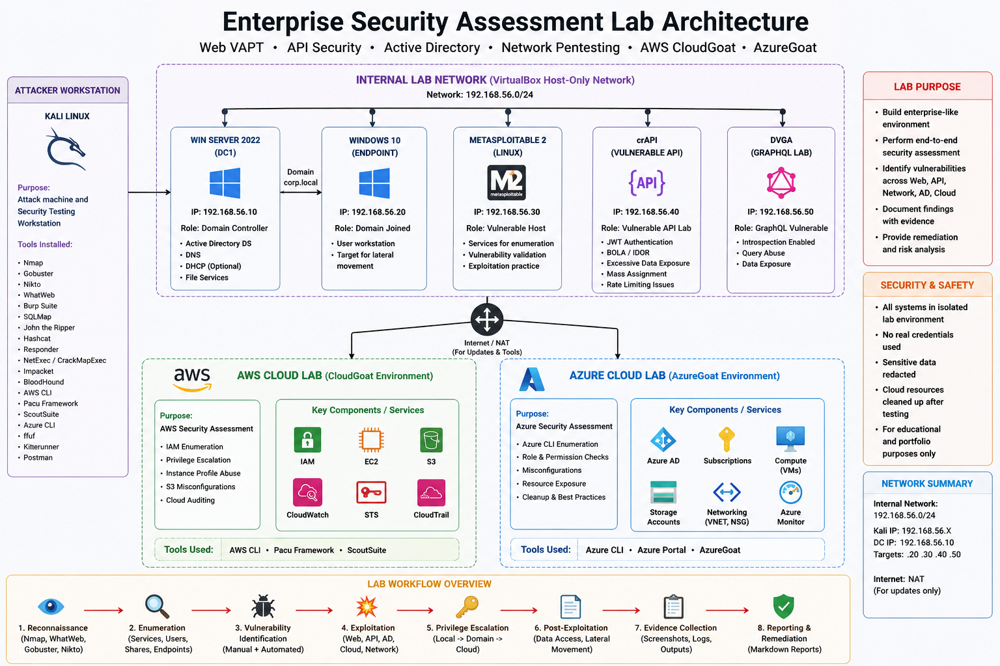

<div align="center">


</div>

<div align="center">

[](https://git.io/typing-svg)

</div>

---

<div align="center">


<br/>


<br/>


<br/>


<br/>


<br/>


</div>

---

# 🛡️ Enterprise Security Assessment Lab

## ⚡ Project Overview

This repository documents a complete hands-on **Enterprise Security Assessment Lab** built to demonstrate practical cybersecurity capability across:

* 🌐 Web Application VAPT
* 🔌 API Security Testing
* 🏢 Internal Network and Active Directory Assessment
* ☁️ AWS Cloud Security
* 🔵 Azure Security and Cloud Lab Handling
* 🧾 Evidence-based documentation
* 🔐 Secret redaction and responsible cleanup

This project is designed as a recruiter-ready cybersecurity portfolio project. It does not only show tools being executed; it shows a complete security workflow:

```text
Lab Design
→ Target Deployment
→ Reconnaissance
→ Enumeration
→ Vulnerability Validation
→ Attack Path Analysis
→ Evidence Capture
→ Redaction
→ Cleanup Verification
→ Professional Documentation
```

The strongest part of this lab is that every completed section is supported by real screenshots, terminal outputs, tool evidence, and cleanup checks.

> ⚠️ **Ethical Notice:** All testing documented in this repository was performed only against self-owned, intentionally vulnerable, or private lab environments. No third-party or production systems were tested.

---

# 🧭 Project Status

| Domain                   |                               Status | Summary                                                                                                                                                              |
| ------------------------ | -----------------------------------: | -------------------------------------------------------------------------------------------------------------------------------------------------------------------- |
| 🌐 Web VAPT              |     ✅ Completed Practical Assessment | DVWA-based testing covering recon, enumeration, Burp, SQLi, sqlmap, XSS, command injection, file upload, CSRF, and hash cracking                                     |
| 🔌 API Security          |     ✅ Completed Practical Assessment | crAPI, JWT analysis, BOLA/IDOR testing, excessive data exposure, rate-limit testing, mass assignment, hidden endpoint discovery, GraphQL, and OAuth request analysis |
| 🏢 Active Directory      |                          ✅ Completed | Internal AD attack chain with Responder, Hashcat, Kerberoasting, BloodHound, DCSync, and Pass-the-Hash                                                               |
| ☁️ AWS Cloud Security    |                          ✅ Completed | CloudGoat, Pacu, ScoutSuite, S3 public access test, IMDS credential exposure, IAM privilege escalation, cleanup, and billing verification                            |
| 🔵 Azure Security        | ✅ Completed as Quota-Limited Attempt | AzureGoat attempted, quota limitation documented, Terraform cleanup completed, resource group deletion verified                                                      |
| 🟢 GCP                   |                 ✅ Deferred by Design | Deferred intentionally to avoid unnecessary billing and cleanup risk after AWS/Azure work                                                                            |
| 🧠 Certification Roadmap |                          ✅ Completed | Learning and certification path documented                                                                                                                           |

---

# 🗺️ Lab Architecture
---


---


# 🧰 Complete Tools Arsenal

<table>
<tr>
<th>Category</th>
<th>Tools</th>
</tr>

<tr>
<td>🌐 Web VAPT</td>
<td>


</td>
</tr>

<tr>
<td>🔌 API Security</td>
<td>


</td>
</tr>

<tr>
<td>🏢 Active Directory</td>
<td>


</td>
</tr>

<tr>
<td>☁️ Cloud Security</td>
<td>


</td>
</tr>

</table>


---

# 📁 Repository Structure

```text
Enterprise-Security-Assessment-Lab/
│
├── README.md
├── .gitignore
│
├── 01-web-vapt/
│   ├── README.md
│   ├── screenshots/
│   ├── tool-outputs/
│   └── scripts/
│
├── 02-api-security/
│   ├── README.md
│   ├── screenshots/
│   ├── postman-collections/
│   ├── tools/
│   └── scripts/
│
├── 03-ad-network/
│   ├── README.md
│   ├── screenshots/
│   ├── reports/
│   └── notes/
│
├── 04-cloud-security/
│   ├── README.md
│   ├── screenshots/
│   ├── reports/
│   └── scripts/
│
├── 05-azure-security/
│   ├── README.md
│   ├── screenshots/
│   └── reports/
│
└── 06-roadmap/
    └── certification-roadmap.md
```

---

# 📌 Executive Summary

This lab demonstrates the ability to perform structured security testing across multiple enterprise security domains.

The project includes:

* Practical reconnaissance and enumeration
* Vulnerability validation in controlled environments
* Web application attack testing
* API security testing
* Active Directory attack path analysis
* AWS cloud privilege escalation testing
* Azure cloud deployment and cleanup discipline
* Evidence collection and professional documentation
* Responsible handling of secrets, tokens, hashes, and cloud resources

The project is intentionally evidence-based. Claims are supported with screenshots and outputs rather than exaggerated finding counts.

---

# 🌐 Sub-Project 1 — Web Application VAPT

## 🎯 Objective

The Web VAPT section demonstrates practical web application vulnerability assessment against intentionally vulnerable web applications, mainly DVWA.

The goal was to practise a realistic web testing flow:

```text
Environment Setup
→ Passive Recon
→ Service Discovery
→ Technology Fingerprinting
→ Directory Enumeration
→ Vulnerability Scanning
→ Manual Testing with Burp
→ SQL Injection Validation
→ XSS Validation
→ Command Injection Testing
→ File Upload Testing
→ CSRF Testing
→ Evidence Capture
```

---

## 🧰 Tools Used

| Tool               | Purpose                                           |
| ------------------ | ------------------------------------------------- |
| Kali Linux         | Main attack environment                           |
| Docker             | Running vulnerable lab targets                    |
| Nmap               | Port and service scanning                         |
| Gobuster           | Directory and file enumeration                    |
| Nikto              | Web server vulnerability scanning                 |
| WhatWeb            | Technology fingerprinting                         |
| Burp Suite         | HTTP interception and repeater testing            |
| SQLMap             | SQL injection validation and database enumeration |
| John the Ripper    | Hash cracking                                     |
| Browser / DevTools | Manual validation and evidence capture            |

---

## ✅ Completed Web VAPT Work

| Test Area                               |      Status |
| --------------------------------------- | ----------: |
| Kali environment setup                  | ✅ Completed |
| Docker vulnerable target deployment     | ✅ Completed |
| DVWA login/browser access               | ✅ Completed |
| Tool version verification               | ✅ Completed |
| Nmap full port scan                     | ✅ Completed |
| Gobuster directory enumeration          | ✅ Completed |
| Nikto scan findings                     | ✅ Completed |
| WhatWeb technology fingerprinting       | ✅ Completed |
| SQL Injection manual validation         | ✅ Completed |
| SQLMap database enumeration             | ✅ Completed |
| SQLMap users table dump                 | ✅ Completed |
| MD5 hash cracking with John             | ✅ Completed |
| Burp intercepted request                | ✅ Completed |
| Burp Repeater modified request/response | ✅ Completed |
| Reflected XSS validation                | ✅ Completed |
| Stored XSS payload/source validation    | ✅ Completed |
| Command injection validation            | ✅ Completed |
| File upload webshell confirmation       | ✅ Completed |
| CSRF forged request proof               | ✅ Completed |
| Recon report file generation            | ✅ Completed |

---

## 📸 Web VAPT Evidence Screenshots

| Screenshot                                       | Evidence Purpose                       |
| ------------------------------------------------ | -------------------------------------- |
| `01-kali-linux-desktop-full-screen.png`          | Kali Linux lab environment             |
| `02-docker-containers-running.png`               | Docker vulnerable targets running      |
| `03-dvwa-login-page-browser.png`                 | DVWA accessible in browser             |
| `04-tools-installed-version-check.png`           | Required tools installed               |
| `05-nmap-full-port-scan-output.png`              | Nmap full port/service scan            |
| `06-gobuster-directory-results.png`              | Gobuster directory enumeration         |
| `06-gobuster-directory-results(M).png`           | Additional Gobuster enumeration output |
| `07-nikto-scan-findings.png`                     | Nikto web scan findings                |
| `07-john-md5-hashes-cracked.png`                 | MD5 hash cracking evidence             |
| `08-whatweb-tech-fingerprint-p1.png`             | WhatWeb fingerprinting evidence        |
| `08-whatweb-tech-fingerprint-p2.png`             | WhatWeb fingerprinting evidence        |
| `08-whatweb-tech-fingerprint-p3.png`             | WhatWeb fingerprinting evidence        |
| `08-whatweb-tech-fingerprint-p4.png`             | WhatWeb fingerprinting evidence        |
| `09-dvwa-sqli-vulnerable-input-response.png`     | Manual SQL injection validation        |
| `09-recon-report-files-generated.png`            | Recon report files generated           |
| `10-sqlmap-database-enumeration.png`             | SQLMap database enumeration            |
| `11-sqlmap-users-table-dump.png`                 | SQLMap users table dump                |
| `13-burp-intercepted-request.png`                | Burp request interception              |
| `14-burp-repeater-modified-request-response.png` | Burp Repeater validation               |
| `15-reflected-xss-alert-popup.png`               | Reflected XSS validation               |
| `15-reflected-xss-alert-popup-p2.png`            | Additional reflected XSS evidence      |
| `16-stored-xss-payload-source.png`               | Stored XSS payload/source evidence     |
| `17-command-injection-id-whoami-output.png`      | Command injection proof                |
| `18-file-upload-webshell-confirmed-p1.png`       | File upload webshell proof             |
| `18-file-upload-webshell-confirmed-p2.png`       | Additional webshell confirmation       |
| `19-csrf-forged-request-proof.png`               | CSRF forged request evidence           |
| `Passive-Recon-p1.png`                           | Passive reconnaissance evidence        |
| `Passive-Recon-p2.png`                           | Passive reconnaissance evidence        |
| `Passive-Recon-p3.png`                           | Passive reconnaissance evidence        |
| `Directory-&-File-Enumeration-with-Gobuster.png` | Directory/file enumeration summary     |

---

## 🖼️ Web Screenshot Gallery

> Sensitive values such as cookies, session IDs, hashes, cracked passwords, and shell paths should be redacted before public release.


---

## 🧠 Web Security Lessons

* Automated scanners help with coverage, but manual validation is essential.
* SQL injection can expose backend database structure and stored credentials.
* Hash dumps must be handled carefully and redacted before publication.
* Burp Suite is useful for validating and modifying requests safely.
* XSS testing should be performed only in authorized lab targets.
* Command injection and file upload issues can lead to severe compromise in real environments.
* CSRF testing demonstrates how state-changing requests can be abused when protections are weak.

---

# 🔌 Sub-Project 2 — API Security Testing

## 🎯 Objective

The API Security section demonstrates practical testing of REST APIs, JWT-based authentication, BOLA/IDOR-style access control, rate-limit behaviour, mass assignment behaviour, hidden endpoint discovery, GraphQL introspection, and OAuth request analysis.

The assessment was performed only against intentionally vulnerable or safe lab environments such as crAPI, DVGA/GraphQL labs, and OAuth-focused training labs.

---

## 🧰 Tools Used

| Tool               | Purpose                                           |
| ------------------ | ------------------------------------------------- |
| crAPI              | Intentionally vulnerable API lab                  |
| Postman            | API request building and collection management    |
| Burp Suite         | API request analysis and OAuth request inspection |
| JWT.io             | JWT decoding and claim inspection                 |
| ffuf               | Rate-limit and endpoint testing                   |
| Kiterunner         | Hidden API endpoint discovery                     |
| DVGA               | GraphQL testing lab                               |
| curl / jq          | API response testing and parsing                  |
| Browser / DevTools | API observation and evidence capture              |

---

## ✅ Completed API Security Work

| Test Area                               |      Status |
| --------------------------------------- | ----------: |
| crAPI Docker containers running         | ✅ Completed |
| crAPI homepage accessible               | ✅ Completed |
| Postman login request and JWT workflow  | ✅ Completed |
| JWT decoding and token claim inspection | ✅ Completed |
| Postman collection structure            | ✅ Completed |
| API tools version check                 | ✅ Completed |
| BOLA/IDOR-style access test             | ✅ Completed |
| JWT manipulation attempt                | ✅ Completed |
| Excessive data exposure review          | ✅ Completed |
| Rate-limit behaviour testing with ffuf  | ✅ Completed |
| Mass assignment extra field test        | ✅ Completed |
| Kiterunner hidden endpoint discovery    | ✅ Completed |
| DVGA GraphQL lab running                | ✅ Completed |
| GraphQL endpoint availability check     | ✅ Completed |
| GraphQL introspection/schema discovery  | ✅ Completed |
| GraphQL user data query test            | ✅ Completed |
| OAuth request analysis in Burp          | ✅ Completed |

---

## 📸 API Evidence Screenshots

| Screenshot                                      | Evidence Purpose                          |
| ----------------------------------------------- | ----------------------------------------- |
| `00-crapi-docker-containers-running.png`        | crAPI Docker containers running           |
| `01-crapi-homepage-browser.png`                 | crAPI homepage accessible                 |
| `02-postman-login-jwt-token.png`                | Login request and JWT workflow in Postman |
| `03-jwtio-decoded-token.png`                    | JWT decoded and inspected                 |
| `04-postman-collection-structure.png`           | Postman collection structure              |
| `05-api-tools-version-check.png`                | API testing tools verified                |
| `05-bola-accessing-another-user-data.png`       | BOLA/IDOR-style object access test        |
| `06-JWT-decodetoken-analysis.png`               | JWT claim/token analysis                  |
| `06-jwt-attack-attempt-token-rejected.png`      | JWT manipulation attempt rejected         |
| `07-excessive-data-exposure-hidden-fields.png`  | Excessive data exposure review            |
| `08-no-rate-limiting-ffuf-running-p1.png`       | Rate-limit behaviour testing with ffuf    |
| `08-no-rate-limiting-ffuf-running-p2.png`       | Continued ffuf/rate-limit testing         |
| `09-mass-assignment-extra-fields-rejected.png`  | Mass assignment test rejected             |
| `10-kiterunner-hidden-endpoints-discovered.png` | Hidden API endpoint discovery             |
| `11-dvga-graphql-lab-running.png`               | DVGA GraphQL lab running                  |
| `11-graphql-endpoint-alive.png`                 | GraphQL endpoint availability             |
| `12-graphql-introspection-schema-discovery.png` | GraphQL introspection/schema discovery    |
| `13-graphql-user-data-query-test.png`           | GraphQL user data query test              |
| `14-oauth-lab-burp-request-analysis.png`        | OAuth request analysis in Burp            |

---

## 🖼️ API Screenshot Gallery

> JWTs, authorization headers, cookies, emails, user IDs, access tokens, refresh tokens, and client secrets should be redacted before public release.


---

## 🧠 API Security Lessons

* JWT decoding is useful for analysis, but decoding alone does not mean compromise.
* Rejected JWT manipulation attempts are still valuable evidence because they show control validation.
* BOLA/IDOR testing must be performed carefully against authorized lab targets.
* Excessive data exposure can reveal fields that should not be returned to users.
* Rate-limit behaviour should be tested and documented clearly.
* Rejected mass assignment attempts demonstrate defensive behaviour.
* Kiterunner and ffuf can help discover hidden or undocumented endpoints.
* GraphQL introspection may reveal schema details if exposed.
* OAuth request analysis requires careful redaction of tokens, client data, and authorization values.

---

# 🏢 Sub-Project 3 — Internal Network & Active Directory Pentest

## 🎯 Objective

The Active Directory section demonstrates a complete internal network attack path in a private Windows domain environment. The focus was to understand how weak passwords, excessive privileges, exposed authentication protocols, and misconfigured domain permissions can lead to domain compromise.

---

## 🏗️ Lab Environment

| Component         | Details                                            |
| ----------------- | -------------------------------------------------- |
| Attack Machine    | Kali Linux                                         |
| Domain Controller | Windows Server                                     |
| Workstation       | Windows 10 domain-joined endpoint                  |
| Domain            | `corp.local`                                       |
| Network           | Private lab network                                |
| Purpose           | Controlled Active Directory attack path validation |

---

## 🧰 Tools Used

| Tool                      | Purpose                                    |
| ------------------------- | ------------------------------------------ |
| Nmap                      | Network and service discovery              |
| enum4linux-ng / SMB tools | SMB and domain enumeration                 |
| Responder                 | NTLMv2 hash capture                        |
| Hashcat                   | Offline hash cracking                      |
| NetExec / CrackMapExec    | SMB validation and enumeration             |
| Impacket                  | Kerberoasting, DCSync, Pass-the-Hash       |
| BloodHound                | Active Directory attack path visualization |
| Neo4j                     | BloodHound graph database                  |

---

## 🔗 Completed AD Attack Chain

```text
Network Discovery
→ SMB Enumeration
→ NTLMv2 Hash Capture
→ Offline Hash Cracking
→ Credential Validation
→ Kerberoasting
→ Kerberoast Hash Cracking
→ BloodHound Collection
→ Attack Path Analysis
→ DCSync Testing
→ Pass-the-Hash Validation
→ Privileged Access Evidence
```

---

## 📸 AD Evidence Screenshots

| Screenshot                                     | Evidence Purpose                                |
| ---------------------------------------------- | ----------------------------------------------- |
| `10-responder-ntlmv2-hash-captured.png`        | NTLMv2 hash capture                             |
| `11-hashcat-ntlmv2-cracked.png`                | Captured hash cracked                           |
| `12-smb-enumeration-credential-validation.png` | SMB credential validation                       |
| `13-kerberoasting-spn-ticket-requested.png`    | Kerberoasting SPN ticket request                |
| `14-kerberoast-hash-cracked.png`               | Kerberoast hash cracked                         |
| `15-bloodhound-attack-path-domain-admin.png`   | BloodHound path to Domain Admin                 |
| `16-bloodhound-domain-overview-graph.png`      | BloodHound domain overview                      |
| `17-pass-the-hash-system-shell-obtained.png`   | Pass-the-Hash validation                        |
| `18-dcsync-domain-hashes-dumped.png`           | DCSync evidence with hashes redacted            |
| `18b-dcsync-all-domain-hashes-dumped.png`      | Full DCSync output with sensitive data redacted |

---

## 🖼️ AD Screenshot Gallery


---

## 🧠 AD Security Lessons

* Weak passwords can turn captured hashes into valid credentials.
* LLMNR/NBT-NS poisoning can expose NTLMv2 hashes.
* Kerberoastable service accounts require long and complex passwords.
* BloodHound reveals privilege paths that are difficult to identify manually.
* DCSync permissions can expose domain credential material.
* Pass-the-Hash demonstrates why hashes must be protected like passwords.
* krbtgt material could enable Golden Ticket-style attacks if misused.
* Hashes, passwords, tickets, and secrets must never be published unredacted.

---

# ☁️ Sub-Project 4 — AWS Cloud Security Assessment

## 🎯 Objective

The AWS section demonstrates practical cloud security testing using intentionally vulnerable AWS lab environments. The focus was IAM enumeration, privilege escalation analysis, S3 exposure testing, ScoutSuite auditing, IMDS credential exposure, and responsible cleanup.

---

## ✅ AWS Safety Controls

| Control                             |      Status |
| ----------------------------------- | ----------: |
| Root MFA enabled                    | ✅ Completed |
| Budget/free-tier monitoring checked | ✅ Completed |
| Dedicated lab IAM user used         | ✅ Completed |
| CloudGoat deployed temporarily      | ✅ Completed |
| Sensitive credentials redacted      | ✅ Completed |
| CloudGoat destroyed after testing   | ✅ Completed |
| EC2 cleanup verified                | ✅ Completed |
| Billing/free-tier checked           | ✅ Completed |

---

## 🧰 Tools Used

| Tool        | Purpose                                |
| ----------- | -------------------------------------- |
| AWS CLI     | AWS authentication and enumeration     |
| CloudGoat   | Intentionally vulnerable AWS scenarios |
| Pacu        | IAM privilege escalation scan          |
| ScoutSuite  | AWS security audit                     |
| Terraform   | CloudGoat deployment/destruction       |
| curl / jq   | IMDS and metadata testing              |
| AWS Console | Billing, free-tier, and cleanup checks |

---

## ✅ Completed AWS Work

| Test Area                                         |      Status |
| ------------------------------------------------- | ----------: |
| AWS CLI authentication                            | ✅ Completed |
| IAM permissions enumeration                       | ✅ Completed |
| Pacu privilege escalation scan                    | ✅ Completed |
| S3 unauthenticated access test                    | ✅ Completed |
| ScoutSuite HTML report overview                   | ✅ Completed |
| ScoutSuite detailed finding review                | ✅ Completed |
| IMDS credential exposure through vulnerable proxy | ✅ Completed |
| IAM instance profile privilege escalation         | ✅ Completed |
| Target EC2 objective completed                    | ✅ Completed |
| EC2 cleanup verification                          | ✅ Completed |
| Free-tier/billing verification                    | ✅ Completed |

---

## 📸 AWS Evidence Screenshots

| Screenshot                                      | Evidence Purpose                               |
| ----------------------------------------------- | ---------------------------------------------- |
| `iam-permissions-enumeration.png`               | IAM identity and permission enumeration        |
| `pacu-privesc-scan-results.png`                 | Pacu privilege escalation scan                 |
| `s3-public-bucket-unauthenticated-access.png`   | S3 unauthenticated/public access test          |
| `scoutsuite-html-report-overview.png`           | ScoutSuite report dashboard                    |
| `scoutsuite-specific-high-severity-finding.png` | ScoutSuite detailed finding                    |
| `imds-ec2-metadata-credentials-stolen.png`      | IMDS credential exposure with secrets redacted |
| `13-cloudgoat-ec2-cleanup-verified.png`         | EC2 cleanup verification                       |
| `14-aws-free-tier-cleanup-check.png`            | Free-tier/billing cleanup verification         |

---

## 🖼️ AWS Screenshot Gallery


---

## 🔗 AWS Attack Path Summary

```text
Low-Privileged CloudGoat User
→ IAM Permission Enumeration
→ Pacu Privilege Escalation Scan
→ Instance Profile Role Manipulation
→ Privileged EC2 Role Assumption
→ Metadata Credential Exposure
→ Target EC2 Objective Completed
→ CloudGoat Destroy
→ Billing and Cleanup Verification
```

---

## 🧠 AWS Security Lessons

* IAM permissions should follow least privilege.
* Public S3 access must be reviewed and restricted.
* Instance metadata exposure can leak temporary role credentials.
* IMDSv2 should be enforced where possible.
* IAM instance profiles can create privilege escalation paths.
* Automated auditing tools such as ScoutSuite help identify misconfigurations.
* Cloud cleanup and billing verification are part of responsible cloud security work.

---

# 🔵 Sub-Project 5 — Azure Security Assessment

## 🎯 Objective

The Azure section demonstrates safe Azure cloud lab handling using Azure Portal, Azure Cloud Shell, Azure CLI, and Terraform.

AzureGoat was attempted in a private Azure subscription. The deployment was blocked by quota restrictions, documented clearly, and cleaned up responsibly.

---

## 🧰 Tools Used

| Tool                  | Purpose                                  |
| --------------------- | ---------------------------------------- |
| Azure Portal          | Subscription, cost, and resource review  |
| Azure Cost Management | Budget setup and monitoring              |
| Azure Cloud Shell     | Authenticated browser-based CLI          |
| Azure CLI             | Azure resource operations                |
| Terraform             | AzureGoat deployment attempt and cleanup |

---

## ✅ Completed Azure Work

| Step                                   |      Status |
| -------------------------------------- | ----------: |
| Azure account login                    | ✅ Completed |
| Budget setup                           | ✅ Completed |
| Azure Cloud Shell authentication       | ✅ Completed |
| AzureGoat Terraform deployment attempt | ✅ Completed |
| Quota limitation identified            | ✅ Completed |
| Terraform destroy completed            | ✅ Completed |
| `azuregoat_app` resource group deleted | ✅ Completed |
| Portal cleanup verification            | ✅ Completed |

---

## ⚠️ AzureGoat Result

AzureGoat deployment was attempted, but the subscription blocked the required resources due to quota restrictions.

Observed issues included:

* App Service Plan quota restriction
* Basic Public IP quota restriction
* Subscription-level limitations on lab deployment

The deployment was not forced. Partial resources were destroyed with Terraform, and the `azuregoat_app` resource group deletion was verified.

---

## 📸 Azure Evidence Screenshots

| Screenshot                                               | Evidence Purpose                                        |
| -------------------------------------------------------- | ------------------------------------------------------- |
| `01-azure-cli-authenticated.png`                         | Azure Cloud Shell / CLI authentication                  |
| `azuregoat-deployment-blocked-by-subscription-quota.png` | AzureGoat deployment blocked by quota                   |
| `06-azuregoat-cleanup-confirmed.png`                     | Terraform destroy and resource group deletion confirmed |

---

## 🖼️ Azure Screenshot Gallery


---

## 🧠 Azure Security Lessons

* Cloud subscription quotas can affect security lab deployment.
* Failed deployments still require cleanup.
* Azure Cloud Shell can be more reliable than a broken local CLI environment.
* Terraform destroy should always be verified.
* Resource group deletion should be confirmed after cleanup.
* Budget monitoring is essential for real cloud labs.

---

# 🟢 GCP Status — Deferred by Design

GCPGoat was intentionally deferred.

## Reason

* AWS CloudGoat was already completed.
* AzureGoat reached real subscription quota limitations.
* Running multiple vulnerable cloud labs at once increases billing and cleanup risk.
* The current project already demonstrates strong AWS and Azure cloud security practice.

## Future GCP Plan

```text
Create isolated GCP project
→ Configure budget alert
→ Authenticate with gcloud
→ Enumerate IAM and service accounts
→ Review Cloud Storage permissions
→ Practise safer GCP labs
→ Attempt GCPGoat later only after billing workflow is mature
```

This is a deliberate risk-management decision, not an unfinished lab.

---

# 📊 Evidence Matrix

| Area                               | Evidence Type                                   |       Status |
| ---------------------------------- | ----------------------------------------------- | -----------: |
| Web environment setup              | Docker/Kali screenshots                         |  ✅ Completed |
| Web recon                          | Passive recon, WhatWeb, Nmap                    |  ✅ Completed |
| Web enumeration                    | Gobuster, Nikto                                 |  ✅ Completed |
| Web exploitation validation        | SQLi, XSS, command injection, file upload, CSRF |  ✅ Completed |
| Web tooling                        | Burp, SQLMap, John                              |  ✅ Completed |
| API lab setup                      | crAPI Docker and browser evidence               |  ✅ Completed |
| API authentication                 | Postman login/JWT evidence                      |  ✅ Completed |
| API access control                 | BOLA/IDOR-style testing                         |  ✅ Completed |
| API token testing                  | JWT analysis and rejected attack attempt        |  ✅ Completed |
| API discovery                      | ffuf and Kiterunner evidence                    |  ✅ Completed |
| GraphQL testing                    | DVGA, endpoint, introspection, query testing    |  ✅ Completed |
| OAuth testing                      | Burp request analysis                           |  ✅ Completed |
| AD credential attacks              | Responder, Hashcat, Kerberoasting               |  ✅ Completed |
| AD privilege analysis              | BloodHound attack paths                         |  ✅ Completed |
| AD domain compromise simulation    | DCSync and Pass-the-Hash                        |  ✅ Completed |
| AWS IAM testing                    | IAM enumeration and Pacu                        |  ✅ Completed |
| AWS cloud misconfiguration testing | S3, ScoutSuite, IMDS                            |  ✅ Completed |
| AWS cleanup                        | EC2 and billing checks                          |  ✅ Completed |
| Azure lab handling                 | Auth, quota limitation, cleanup                 |  ✅ Completed |
| GCP                                | Deferred by design                              | ✅ Documented |

---


# 📚 Methodology and Standards

| Framework / Standard      | How It Applies                                                                        |
| ------------------------- | ------------------------------------------------------------------------------------- |
| OWASP Top 10              | Web application vulnerability testing                                                 |
| OWASP API Security Top 10 | API authentication, authorization, data exposure, rate limit, mass assignment testing |
| MITRE ATT&CK              | AD and cloud attack technique mapping                                                 |
| PTES                      | General penetration testing workflow                                                  |
| NIST SP 800-115           | Technical security testing guidance                                                   |
| CIS Benchmarks            | Cloud and configuration review reference                                              |
| CVSS v3.1                 | Severity scoring reference for future formal reports                                  |

---

# 🎓 Skills Demonstrated

```text
┌───────────────────────────────────────────────┬───────────────────────────────────────────────┐
│ Skill Area                                    │ Evidence                                       │
├───────────────────────────────────────────────┼───────────────────────────────────────────────┤
│ Web reconnaissance                            │ Passive recon, Nmap, WhatWeb                   │
│ Web enumeration                               │ Gobuster, Nikto                                │
│ Web vulnerability validation                  │ SQLi, XSS, command injection, file upload      │
│ HTTP request analysis                         │ Burp intercept and repeater                    │
│ API authentication testing                    │ Postman login and JWT workflow                 │
│ API authorization testing                     │ BOLA/IDOR-style testing                        │
│ API discovery                                 │ ffuf and Kiterunner                            │
│ GraphQL testing                               │ DVGA, endpoint, introspection, query testing   │
│ OAuth request analysis                        │ Burp-based OAuth lab evidence                  │
│ Active Directory enumeration                  │ SMB, BloodHound, domain recon                  │
│ Credential attack validation                  │ Responder, Hashcat, Kerberoasting              │
│ AD privilege path analysis                    │ BloodHound attack path evidence                │
│ Domain compromise simulation                  │ DCSync and Pass-the-Hash in private lab        │
│ AWS IAM security testing                      │ CloudGoat and Pacu                             │
│ AWS cloud misconfiguration review             │ S3, IMDS, ScoutSuite                           │
│ Azure cloud operations                        │ Cloud Shell, CLI, Terraform                    │
│ Cloud cleanup and billing awareness           │ AWS/Azure cleanup verification                 │
│ Evidence handling                             │ Redaction, screenshots, structured reporting   │
└───────────────────────────────────────────────┴───────────────────────────────────────────────┘
```

---

# 🔐 Redaction and Secret Handling

Before publishing any screenshot or output, the following must be redacted:

* AWS account IDs
* Azure subscription IDs
* Azure tenant IDs
* Email addresses
* Public IPs if privacy is required
* Access keys
* Secret access keys
* Session tokens
* JWT tokens
* Authorization headers
* Cookies
* OAuth authorization codes
* OAuth access tokens
* OAuth refresh tokens
* NTLM hashes
* Kerberos hashes
* Cracked passwords
* Private keys
* `.pem` files
* Terraform state data
* DCSync raw secrets

This repository must never include:

```text
.env files
.pem files
Terraform state files
AWS credential files
Azure profile files
Full hash dumps
Raw DCSync dumps
Session tokens
Cloud secret keys
Private keys
Unredacted JWTs
Unredacted OAuth tokens
```

---

# ✅ Cleanup Verification

## AWS Cleanup

AWS cleanup included:

```text
CloudGoat destroy
EC2 instance termination check
S3 bucket cleanup check
IAM role cleanup check
Free Tier / billing check
Budget status check
```

## Azure Cleanup

Azure cleanup included:

```text
Terraform destroy
azuregoat_app resource group deletion
Azure Portal cleanup verification
Budget and billing review
```

## Local Lab Cleanup

Local Docker-based labs can be stopped after evidence capture:

```bash
docker ps
docker stop <container_id>
```


# 🧾 Documentation Status

Current documentation is maintained through Markdown, screenshot evidence, and structured notes.

| Document                              | Purpose                          |                           Status |
| ------------------------------------- | -------------------------------- | -------------------------------: |
| `README.md`                           | Main project overview            |                      ✅ Completed |
| `01-web-vapt/README.md`               | Web VAPT documentation           | ✅ Completed / Evidence available |
| `02-api-security/README.md`           | API Security documentation       | ✅ Completed / Evidence available |
| `03-ad-network/README.md`             | Active Directory documentation   | ✅ Completed / Evidence available |
| `04-cloud-security/README.md`         | AWS Cloud Security documentation | ✅ Completed / Evidence available |
| `05-azure-security/README.md`         | Azure Security documentation     | ✅ Completed / Evidence available |
| `06-roadmap/certification-roadmap.md` | Certification roadmap            |                      ✅ Completed |

---

# 🚀 Future Improvements

Planned improvements include:

* Add final executive summary document
* Add formal Markdown-based reports for each sub-project
* Add CVSS scoring only for confirmed findings
* Add remediation sections for each confirmed issue
* Add MITRE ATT&CK mapping for AD and cloud techniques
* Add defensive recommendations for every attack path
* Add detection engineering section with Wazuh/SOC alerts
* Add GCP mini-lab only after billing and cleanup workflow is mature

---

# 📬 Contact & Connect

<div align="center">

[](https://github.com/YOUR_USERNAME)
[](https://linkedin.com/in/YOUR_PROFILE)
[](mailto:your@email.com)

</div>

---

# ⚖️ Legal and Ethical Disclaimer

```text
┌─────────────────────────────────────────────────────────────────────────────┐
│                              IMPORTANT NOTICE                               │
│                                                                             │
│  All security testing activities documented in this repository were          │
│  performed exclusively in private, self-owned, or intentionally vulnerable   │
│  lab environments created for cybersecurity education and portfolio work.    │
│                                                                             │
│  This project does not include testing against third-party systems,          │
│  production systems, or any environment without authorization.               │
│                                                                             │
│  Techniques shown here must only be used where explicit permission has       │
│  been granted. Unauthorized security testing is illegal and unethical.       │
└─────────────────────────────────────────────────────────────────────────────┘
```

---

<div align="center">


### Built with discipline. Documented with evidence. Practised ethically.


</div>
